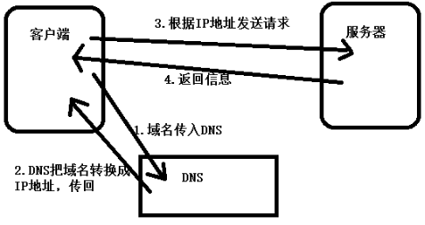

#  Ajax

## 服务器
### 类型

+ 按照服务类型：文件服务器，数据库服务器，邮件服务器，Web服务器
+ 按照操作系统：Linux服务器，Windows服务器
+ 按照应用软件：Apache服务器，Nginx服务器，IIS服务器，Tomcat服务器，WebSphere服务器，boss服务器，Node服务器

### 软件

+ 文件服务器：Server-U，FileZilla，VsFTP（File Transfer Protocol）等
+ 数据库服务器：oracle，mysql，SQL server，DB2，ACCESS等
+ 邮件服务器：Postfix，Sendmail等
+ HTTP服务器：Apache，Nginx，IIS，Tomcat，NodeJS等

### HTTP服务器

+ 网站服务器，主要提供文档（文本，图片，视频，音频）浏览服务
+ 可以结合某一种编程语言处理业务逻辑，由此进行开发，被称为服务端开发
+ 常见的编程语言有php，java，.net，Python，Ruby，Perl等

### 客户端

+ 向服务端索取服务能力的终端
+ 以浏览器为环境，结合HTML，CSS，JavaScript进行的开发叫做前端开发

## 网络
### IP地址

+ 32位（二进制），查看本机IP地址：ping，ipconfig，ifconfig（Linux）

### 域名

+ IP基于数字，不方便记忆，用域名代替IP地址

### DNS服务

+ Domain Name System：域名和IP地址相互映射的一个分布式数据库
+ 记录IP地址和域名之间对应关系的服务
+ 优先级：本机的host优先于DNS服务器
+ ipconfig、flushdns刷新DNS
+ 客户端将域名传入DNS，DNS把域名转换成IP地址返回给客户端，之后客户端根据IP地址发送请求给服务器，服务器响应，返回信息

  

### 端口  

+ 端口是计算机与外界通讯交流的出口，每个端口对应不同的服务
+ 查看端口占用情况：netstat-an
+ 常见端口：80，8080，3306，21，22

## 架构
### C/S结构

+ Client Sever不同的服务器需要安装不同的客户端软件
+ 比如 QQ，迅雷等一系列软件。换一台电脑就要重新安装。并且还需要适配不同的系统。不方便

### B/S结构

+ Broswer Sever所有的服务都可以通过浏览器来完成，不需要兼容操作系统，不同客户端都可以操作
+ 比如百度脑图
+ 操作稳定性较差，流畅度较弱

## PHP
### 简单程序

+ 地址栏模拟
+ 默认返回的内容，浏览器解析成html
+ 每句代码必须加分号
+ PHP：Hypertext Preprocessor超文本预处理器
+ PHP语言的运算符和JS一样

```php
<?php
  	//用来指定编码集
	header('Content-Type:text/html;charset=utf-8');
	//这是一个最简单的PHP程序
	echo 'hello world!';
?>
```
### 变量

+ 变量以$开头，由字母数字下划线组成，不能以数字开头
+ 大小写敏感（区分大小写）
+ 输出顺序是自上向下的，相当于js中的document.write()
+ 单引号中的内容就是字符串
+ 双引号中的内容会执行
+ 符后面的内容和构成一个变量名称
+ 如果前边声明的变量是$name=xgg;
+ 输出echo “$name17” 会报错，因为找不到名为”name17”的变量
+ 输出echo “$name 17” 会输出 xgg 17

### 数据类型

```php
<?php
  	//字符型
	$str='hello world';
	//整型
	$num=10;
	//浮点型
	$float=10.5;
	//布尔型
	//布尔型在输出的时候，true为1，false为空
	$bool=true;
?>
```

- 要注意索引数组和关联数组的区别

  ```php
  <?php
    	//索引数组
  	$indexarr=array(1,2,3);
  	echo $indexarr[0];
  	echo $indexarr[2];
  	//关联数组
  	$arr=array('name'=>'itcast','age'=>10);
  	echo $arr['name'];
  	echo $arr['age'];
  ?>
  ```

- public相当于JS中的全局变量

- private相当于JS中的局部变量

- 对象

  ```php
  <?php
    	class Person {
      	public $name='itcast';
    		public $age=10;
  	}
  	$person=new Person;
  	echo $person->name;
  ?>
  ```

- null是PHP中一种特殊的数据类型，表示空值，表示为该变量设置任何值null，不区分大小写，null和NULL一样

### 运算符&内容输出

+ echo：输出简单数据类型，如字符串，数值。如果用echo输出数组，只能得到类型名字，得不到内容
+ print_r()：输出复杂数据类型的结构，如数组
+ var_dump()：输出详细信息，如对象，数组

```php
$arr=array('itcast','今年','10岁了');
//只能输出简单类型
echo $arr;
//输出详细信息
print_r($arr);
$hello='hello';
//输出详细信息
var_dump($hello);
```

### 函数

+ PHP中有超过700个内建函数
+ 函数名对大小写不敏感
+ 有参数一定传，但是如果有默认值可以不传

### 表单

+ 表单name属性设置服务端接收所传递数据，如果不带name属性就无法提交
+ 表单action属性设置接收数据的处理程序，表示提交的地址（后台处理程序）
+ 表单method属性设置发送数据的方式，表示提交的方式
+ 当上传文件时需要设置enctype=”multipart/form-data”，并且只能用post的方式上传
+ 递交方式和获取方式要对应
+ $_GET，PHP的内置变量，接收get传值（简单数据类型）默认提交方式（提交数据拼接到URL地址栏中）提交大小4k左右（地址栏长度有限）
+ $_POST，PHP的内置变量，接收post传值（简单数据类型）数据提交到请求报文中（更安全）。提交大小几乎没有限制。
+ $_FILES，PHP的内置变量，接收文件上传（获取文件类型）
+ $_POST，$_GET获取的都是字符串类型的数据
+ $_FILES获取文件类型数据

### 文件导入

+ include导入的是HTML页面
+ require导入的是PHP程序

## 传输协议
### HTTP

+ HTTP（HyperText Transfer Protocol）超文本传输协议
+ HTML（HyperText Markup Language）超文本标记语言
+ http协议是由客户端到服务器的请求（request）和从服务器到客户端的响应（response）进行了约束和规范。即http协议主要由请求和响应组成。
+ 常用的请求方法POST，GET，PUT，DELETE
+ GET和POST请求方式的差异
+ GET没有请求主体，使用xhl.send(null)
+ GET可以通过在请求URL上添加请求参数
+ POST可以通过设置xhl.send(‘name=itcast&age=17’)
+ POST需要设置
+ GET效率更好
+ GET大小限制4k，POST没有限制

### 请求和请求报文

+ 由客户端发起，规范为：请求行，请求头，请求主体
+ 请求行：
  * get方式会在地址后面拼接参数
    *  /heima11/day02/03.form.php?username=xgg&password=1 HTTP/1.1
  * post方式就是简单的地址
    *  /heima11/day02/03.form.php HTTP/1.1
+ 请求头：
  * Host：localhost请求的主机
  * User-Agent：很重要，包含客户端的信息
  * Accept：接受的文档MIME类型，text/html，application/xhtml+xml等内容
  * Accept-Language：可接受的语言，zh-CN等内容
  * Accept-Encoding：可接受的压缩格式，gzip，deflate，sdch，br等内容
  * Cache-Control：max-age=0控制缓存
  * Content-Type：application/x-www-form-urlencoded以post形式提交表单的时候，请求头中会设置这一项，以get形式提交，则没有
  * Referer：从哪个URL跳转过来的
+ 请求主体：
  * post方式，传递给服务端的数据
  * get方式，空的

### 响应和响应报文

+ 由服务器发起，规范为：状态行，响应头，响应主体
+ 状态行：
  * 由协议版本号，状态码和状态信息构成
  * 200成功，304缓存，403权限，404未找到，500+服务端错误
+ 响应头：
  * Date：响应时间
  * Server：服务器信息
  * Content-Length：响应主体长度
  * Content-Type：响应资源的类型
+ 响应主体：
  * 服务端返给客户端的内容

## Ajax编程
### 异步

+ 程序执行时不会阻塞其他程序执行，程序的执行顺序不依赖程序本身的书写顺序。相反则为同步（按照程序的顺序，依次往下执行，必须等上一程序执行完成之后才能执行下一程序，阻碍程序的执行）。

### XMLHttpRequest

```html
<script>
  	window.onload=function() {
        renderBanner();
      	renderNav();
    }
    var renderBanner=function() {
        var xhr=new XMLHttpRequest();
      	xhr.open('get','banner.php');
      	xhr.send(null);
      	xhr.onreadystatechange=function() {
            if(xhr.readyState==4){
                if(xhr.status==200) {
                    document.querySelector('.banner').innerHTML=xhr.responseText;
                }
            }
        }
    }
    var renderNav=function() {
        var xhr=new XMLHttpRequest();
      	xhr.open('post','nav.php');
      	xhr.setRequestHeader('Content-Type','application/x-www-form-urlencoded');
      	xhr.send('');
      	xhr.onreadystatechange=function() {
            if(xhr.readyState==4){
                if(xhr.status==200) {
                    document.querySelector('.nav').innerHTML=xhr.responseText;
                }
            })
        }
    }
</script> 
```

浏览器內建对象，用于在后台与服务器通信（交换数据），可以实现对网页的部分更新，而不是刷新整个页面

#### 请求

##### Get

* 请求行数据直接加到地址栏后面

* 请求头内容默认

* 请求主体为空

* 通过encodeURI()用来对中文参数进行转码，防止乱码

  ```html
  <script>
    	//利用js内置对象
    	//初始化XMLHttpRequest
    	var xhr=new XMLHttpRequest();
    	//遵循http协议
    	//请求行
    	xhr.open('get','09.ajax.php?name=xgg&age=17');
    	//请求头 为空
    
    	//请求主体
    	xhr.send(null);
  </script>
  ```

##### Post

* 请求行就是地址

* 请求头需要Content-Type的设置

* 请求主体发送请求

  ```html
  <script>
    	//利用js内置对象
    	//初始化XMLHttpRequest
    	var xhr=new XMLHttpRequest();
    	//遵循http协议
    	//请求行
    	xhr.open('post','09.ajax.php');
    	//请求头
    	xhr.setRequestHeader('Content-Type','application/x-www-form-urlencoded');
    	//请求主体
    	xhr.send('name=xgg&age=17');
  </script>
  ```

#### 响应

* readyState有五种状态
* 0 请求未初始化
* 1 请求已经建立，但是还没有发送
* 2 请求已经发送，正在处理中
* 3 请求在处理中，响应有部分数据可用
* 4 响应已完成
* 服务器作出响应需要时间，所以需要监听服务器的状态
* 当readyState的状态发生改变的时候，触发onreadystatechange函数
```html
<script>
  xhr.onreadystatechange=function () {
    if(xhr.readyState==4) {
      /*代表通信完成，这个时候取响应报文*/
      /*响应报文*/
      /*响应状态行*/
      /*状态码*/
      console.log(xhr.status);
      /*状态信息*/
      console.log(xhr.statusText);
      /*响应头*/
      /*获取所有内容，字符串形式*/
      console.log(xhr.getAllResponseHeaders());
      console.log(xhr.getResponseHeader('Content-Type'));
      /*正确返回的内容*/
      if(xhr.status==200) {
        console.log(xhr.responseText);
      }
    }
  }
</script>
```
### XML

+ 指的是可扩展标记语言，主要用来输出和存储数据
+ 必须有一个根元素，可以自定义，标签也可以自定义
+ 空格会被保留，所以不可有空格，不可以数字或点开头，大小写敏感
+ 不可交叉嵌套
+ 可以在标签里定义属性，属性双引号单引号都可以（浏览器自动修正成双引号）
+ 特殊符号用实体 & gt;& lt;& nbsp;
+ 注释写法和HTML一样，不能放在开头
+ 必须闭合（双标签）
+ xml本质是字符串，浏览器在解析的时候，会按照xml格式去预览
+ 可以描述和传输复杂的数据，但是解析获取复杂并且体积大，开发很少使用
+ 在忽略互联网速度的内网还是可以用XML
+ 银行网银系统中大量使用
+ XML是用来传输和存储数据的，而HTML被设计用来显示数据的
+ XML旨在传输数据，HTML旨在显示信息
+ php中用file_get_contents的方式获取xml元素
+ header中一定要把html改成xml否则会报错
+ 通过responseText获取的内容是字符串
+ 通过responseXML获取的内容

### JSON

+ 轻量级文本数据交换格式
+ 独立于语言（每种语言都认识）
+ 数据在名称/值对中
+ 不能写注释
+ 数据由逗号分隔（最后一个键值对不能带逗号）
+ 花括号里面只有一条数据的时候，不加逗号（相当于最后一条数据）
+ 花括号保存对象方括号保存数组
+ 使用双引号
+ json对象没有变量
+ json形式的数据结尾没有分号
+ json数据中的键必须用双引号包括
+ 比XML更小更快更容易解析
+ 在数据的传输过程中，json以文本方式传输，JS操作的是json对象，所以json对象和json字符串之间需要相互转换
+ JSON.parse   json转换成javascript  
+ JSON.stringify  javascript转换成json
+ json_decode  json转换成php
+ json_encode  php转换成json

## 模板引擎 artTemplate
### 语法概述

+ 模板：参照html代码和数据绑定
+ script type=”text/html”不让内容当做js解析执行，在页面中不存在
+ 模板绑定后可以在模板内书写模板语法
+ 模板语法只能书写在<% %>中
+ 使用数据的时候，如果这个数据是传入对象的属性，这个属性相当于一个模板内可以使用的变量
+ 模板的特殊语法和js一样，模板内部可以定义变量，使用分支循环语句
+ 不能使用模板外部变量（全局变量），例如$，window，console等
+ 默认渲染方式是字符串：<%= %>默认渲染方式是字符串，防止xss攻击（cross site scripting 跨站脚本攻击） <%=# %>默认渲染方式是html，从后台传过来的数据可以是 html标签
+ 简洁模板必须写在{{}}中
+ {{each model}} {{/each}}默认索引\$index 默认值\$value
+ {{each model as item i}} {{/each}}默认索引item值 i索引
+ {{if}}{{else}}{{/if}}分支
+ 简介模板不能定义变量
+ 模板引擎作用，渲染工具（把数据动态生成html格式的代码渲染在页面当中）
+ 国外：handlebars，mustache
+ 国内：artTemplate最好，baiduTemplate，velocity
+ 使用步骤：准备数据，准备模板，数据和模板绑定返回html格式的字符串，渲染页面

### 瀑布流加载方法

+ window.onload和$(function)的区别
+ window.onload是将文档中所有的元素都加载出来
+ $(function() {})是将文档中主要元素加载出来
+ 图片还没有加载出来的时候，下面如果排新的子容器，就会把上面的图片盖住，出现图片黏连的情况
+ 两种解决方案：
  + 需要用window.onload，先把图片都加载出来，防止这种情况发生
  + 限定图片的尺寸，图片没有加载出来的时候，尺寸也可以先占空间，尺寸可以由后台数据传到前端，根据子容器的比例，算出图片的大小再进行设置
+ 一部分浏览器有兼容问题，在动态渲染20个容器的时候，选择器可能会失效

## 跨域
### 跨域&同源

+ 同源：协议域名端口号一样
+ 浏览器一般会阻止跨域的操作（同源策略）
+ 具有跨域能力的标签，不具有操作跨域元素的能力
  * link可以请求跨域的数据，不能取到内容
  * script通过src的请求，都是get请求，后台返回的内容引入进来，不管返回的是什么类型，都会被解析成JS并执行，但是可能会报错（不符合JS语法）
  * iframe能对同源文档中的元素进行操作，实际是在页面中开了一个内嵌的页面 

### domain

+ 手动设置顶级域名，跨域可以互相操作，但是两个域的顶级域名必须相同，并且两个域需要同时设置document.domain=’顶级域名’

### 其他

+ hash、name、postMessage

### JSONP

+ xhr无法进行跨域请求
+ JSONP原理：动态创建script标签，通过src属性发送跨域请求，服务端返回一个预先定义好的javascript函数的调用
+ 发送之前必须显示先声明一个函数，函数名字与参与传递的名字要一致
+ 核心是动态添加script标签来调用服务器提供的
+ 遵循js语法，定义一个变量，根据变量获取后台数据
+ 前端定义一个函数success，后台返回一个函数 callback=success，理解成成功回调函数
+ 可以传复杂数据，通过拼接JSON格式的数据，返回的就是JSON对象
+ 一端维护，callback值是前后端的约定，jQuery会自动生成callback
+ 因为是get请求，所以只能在地址栏拼接数据
+ JSONP的jQuery语法，与JSON的jQuery的语法比较，强制类型转换改成jsonp就可以了

### cors

+ 如果传输的数据量比较大，那么需要用post的方式进行传输，就不能再使用JSONP，应该使用cors
+ 使用方法：添加属性，允许某个域名访问。弊端：存在浏览器兼容问题
+ *表示通配符，表示所有网站都可以访问，不安全
+ 可以加具体的域名，比如http://yueban.com


### jQuery提供的方法

```javascript
$.ajax({
  //以何种方式进行传输
  type:'post',
  //地址
  url:'../api/removeUser.php',
  //传输的数据
  data:{id:id},
  //传输数据的类型，默认是json，有jsonp形式
  dataType:'json',
  //发送数据之前的函数
  beforeSend:function(){
      	$btn.addClass('btn-loading')
  },
  //成功之后的函数，可以传入数据
  success:function(data){
        $btn.removeClass('btn-loading');
    	if(data.status=='ok'){
        $deletModal.modal('hide');
      	render();
    }
  }
})
```


