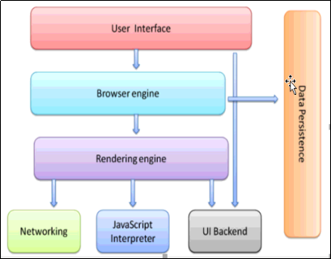
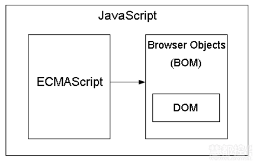

# JavaScript简介

## 浏览器
### 历史

+ 1990年底，欧洲核能研究组织（CERN）科学家Tim Berners-Lee(蒂姆·伯纳斯-李)，在全世界最大的电脑网络——互联网的基础上，发明了万维网（World Wide Web），从此可以在网上浏览网页文件。最早的网页只能在操作系统的终端里浏览，也就是说只能使用命令行操作，网页都是在字符窗口中显示。
+ 1992年底，美国国家超级电脑应用中心（NCSA）开始开发一个独立的浏览器，叫做Mosaic。这是人类历史上第一个浏览器，从此网页可以在图形界面的窗口浏览。
+ 1994年10月，NCSA的一个主要程序员Marc Andreessen(马克·安德森)联合风险投资家Jim Clark(吉姆·克拉克)，成立了Mosaic通信公司（Mosaic Communications），不久后改名为Netspace(网景)。这家公司的方向，就是在Mosaic的基础上，开发面向普通用户的新一代的浏览器Netscape Navigator。
+ 1994年12月，Navigator发布了1.0版，市场份额一举超过90%。
+ 1995年，网景公司为了进行客户端验证，减少不必要的网络请求，提高网络效率，JS作者在10天之内，写出LiveScript。
+ 1995年12月，当时正逢Java比较火，为了“榜大牌”，所以改名“JavaScript”。
+ 1996年3月，Navigator 2.0浏览器正式内置了JavaScript脚本语言。
+ 浏览器的一战，微软为了推广自己的IE浏览器，把IE捆绑到了Windows操作系统中，JScript，并且逐渐将网景公司击败。
+ 一战胜利的果实：ECMAScript标准的确立；就是一个语言规范；只规定了如何进行分支判断、如何定义变量、如何定义方法.....
+ 短暂的和平期：微软发现自己已经天下无敌了，然后就把IE6的开发团队给解散了，在和平期间，JS这门语言主要做：表单验证、简单的特效、狗皮膏药（广告，当时被称为脚本语言）
+ 浏览器的二战：主角：谷歌、IE、火狐（网景的后代）。谷歌在2008年，借助于ajax，开始火起来了，一方面提升渲染引擎的效率、另一方面，提升JS解析引擎的效率，最终，二战以谷歌的胜利结束。谷歌有了一款世界上效率最快的JS解析引擎，叫做chrome V8引擎。
+ 注意：谷歌的 v8 引擎是用来解析执行JS代码的。

### 五大浏览器

- 第一IE，微软开发
- 第二火狐Firefox是网景的后代
- 第三谷歌Google
- 第四苹果Safari
- 第五欧朋Opera

### 工作原理

+ UserInterface 用户界面，我们所看到的浏览器

+ Browser engine 浏览器引擎，用来查询和操作渲染引擎

+ Render engine 用来显示浏览器内容，负责解析 HTML，CSS

+ Networking 网络，负责发送网络请求

+ JavaScript Interpreter JavaScript解析器，负责执行 JavaScript 的代码

+ UI Backend UI 后端，用来绘制类似组合框和弹出窗口

+ Data Persistence 数据持久化，数据存储，cookie，HTML5 中的 sessionStorage

  

### 什么是JavaScript

+ 是一门弱类型的解释型的编程语言
+ 编程语言的特点就是具有逻辑处理能力

## JavaScript组成

+ ECMAscript 制定了JavaScript 的语法规范
+ DOM(document object model) 是一个工具库，提供JavaScript 操作页面上元素的 API
+ BOM(borwer object model) 是一个工具库，提供JavaScript 操作浏览器部分功能的 API
+ 

## JavaScript书写位置

### 内部引用

```html
<script>
  console.log('hello word');
  alert('hello word');
</script>
```
### 外部引用

一般选择这种方式

```html
<script src="main.js"></script>
```
### 内嵌语句

```html
<input type="button" value="baidu" onclick="window.location.href='http://www.baidu.com'">
```
## JavaScript 输出

有多种输出方式，有 alert，document.write，prompt，console 等

```html
  <script>
    console.warn("警告框 一般在系统使用");
    console.error("错误提示信息 一般在系统使用");
    console.info("输出信息");
  </script>
```
## script标签属性
- language 已废弃。原来用于代码使用的脚本语言，大多数浏览器忽略它，不用了
- src 要引入的外部文件
- type 表示脚本语言的类型
- async 值可以省略，立即异步下载外部 JS，不影响页面其他的操作，JS 下载完立即执行
- defer 只可以省略，脚本延迟文档完全被解析和显示后再执行，只有外部脚本可以使用

## 数据类型
### 数值型

+ 进行算数计算时，八进制和十六进制表示的数值最终都将被转换成十进制数值
+ 不能判断两个浮点数是否相等
+ 最小值：Number.MIN_VALUE，这个值为 5e-324
+ 最大值：Number.MAX_VALUE，这个值为 1.7976931348623157e+308
+ 无穷大：Infinity
+ 无穷小：-Infinity
```html
<script>
  console.log(Number.MIN_VALUE);//5e-324
  console.log(Number.MAX_VALUE);//1.7976931348623157e+308
  console.log(1.8e+308);//Infinity
  console.log(5e-325);//0
</script>
```
### NaN

NaN!=NaN，NAN 是 number 类型，表示非数字

```html
<script>
  var a=123;
  var b="qwe";//是NaN类型
  var c="123";
  var d=true;
  var e;//是NaN类型
  var f="";
  var g=NaN;//是NaN类型
  var h=null;
  var i=undefined;//是NaN类型
  console.log(isNaN(a));//false
  console.log(isNaN(b));//true
  console.log(isNaN(c));//false
  console.log(isNaN(d));//false
  console.log(isNaN(e));//true
  console.log(isNaN(f));//false
  console.log(isNaN(g));//true
  console.log(isNaN(h));//false
  console.log(isNaN(i));//true
</script>
```
### 转义符

+ \n 换行
+ \t 制表
+ \b 空格
+ \r 回车
+ \f 进制
+ \ \ 斜杠
+ \ ` 单引号
+ \" 双引号
+ \xnn 十六进制
+ \unnnn 十六进制
+ 转义符和实体不一样
```html
<script>
  console.log('我很喜欢"传\'智\'播客"');
  alert("你好\n世界");
</script>
```
### 转换字符串

+ 转换成字符串有三种方法：toString()、String()、字符串拼接
+ 转换成字符串时，toString()方法对undefined和null不适用，String()对所有数据类型都适用

### 转换数值

+ 转换成数值有三种方法：Number()、parseInt()、parseFloat()
+ 使用减乘除（加是拼接字符串）都可以。 
+ 值-0 不会使原数值发生改变
+ Number()方法是转换成数字，parseInt()是转换成数字整数，parseFloat()是转换成浮点型整数（小数）
+ 下面几种情况转换成数值类型：true 返回 1，false 返回 0，"hello" 返回 NaN，"" 返回 0，123 返回 123，"123abc" 返回 NaN，"abc123" 返回 NaN
+ 字符串是数字类型的字符串，会转变成数值，或者是数字两边有空格的字符串，也会转变成数值。如果是数字之间有空格的字符串，会转变成NaN。

### 转换布尔值

+ 强制转换 Boolean()；隐式转换!!(两个感叹号，取反再取反，原值不变，但是类型已经变成布尔型)
+ Number 类型中，非0数字为真，0为假
+ String 类型中，非空字符串为真，空字符串为假
+ 布尔类型中，true 为真，false 为假
+ undefined 为假，null 为假，object 为真

## 逻辑运算符
### 短路操作

+ &&(与)短路操作，如果第一个操作数能够决定结果，那么就不会对第二个操作数求值
+ ||(或)短路操作，如果第一个操作数的求值结果为 true，就不会对第二个操作数求值了

### 优先级

+ ()优先级最高
+ 一元运算符 ++ -- !
+ 算数运算符 先乘除膜 后加减
+ 关系运算符 > >= < <=
+ 相等运算符 == != === !==
+ 逻辑运算符 先&& 后 ||

## 变量
### 概念规则

+ 变量声明未赋值，其值为 undefined；变量可以连续声明并且赋值
+ 变量时在计算机中存储数据的一个标识符，根据变量名称可以获取内存中存储的数据。使用变量可以方便的获取或者修改内存中的数据。
+ 规则：由字母、数字、$组成，区分大小写，不能是关键字和保留字
+ 规范：变量名称要有意义，变量命名遵守驼峰命名法，首字母小写，第二个单词的首字母大写

### 弱类型

+ JS的变量所存储的数据类型不在定义的时候确定，而在赋值的时候确定。所以被称为弱类型。

## 数组
### 数组遍历

正向遍历

```html
<script>
  for (var i=0;i<arr.length;i++) {
    console.log(arr[i]);
  }
</script>
```
反向遍历
```html
  <script>
  for (var i=arr.length;i>=0;i--) {
    console.log(arr[i]);
  }
  </script>
```
### 数组的 length 属性

+ 数组的 length 属性可以进行手动设置，数组的 length 属性可读可写，字符串的 length 属性可读不可写 

### 冒泡排序

+ 外层比较 arr.length-1 次，内层比较 arr.length-1 次
+ 内层优化：外层比较arr.length-1次，内层比较arr.length1-1-i次
+ 外层优化，加一个判断条件，一旦符合判断条件，立刻停止，省去冗余的步骤