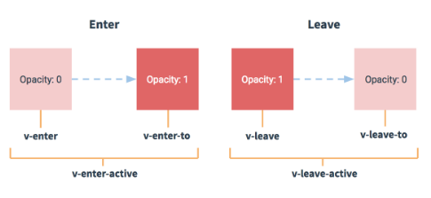
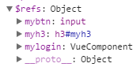
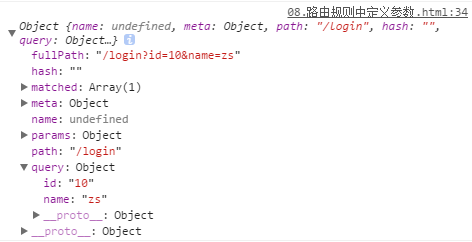
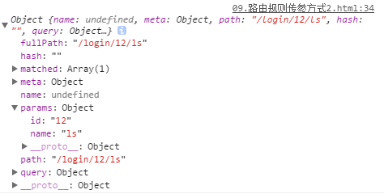
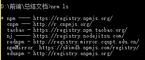
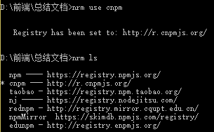

## vue-resource

### 概念

- 实现数据的请求
- then指定成功回调
- 真正的数据是在result.body中放着


- 除了 vue-resource 之外，还可以使用 axios 的第三方包实现实现数据的请求
- 请求地址
  - get请求地址： http://vue.studyit.io/api/getlunbo
  - post请求地址：http://vue.studyit.io/api/post
  - jsonp请求地址：http://vue.studyit.io/api/jsonp


- JSONP的实现原理
  - 由于浏览器的安全性限制，不允许AJAX访问 协议不同、域名不同、端口号不同的 数据接口，浏览器认为这种访问不安全。
  - 可以通过动态创建script标签的形式，把script标签的src属性，指向数据接口的地址，因为script标签不存在跨域限制，这种数据获取方式，称作JSONP
  - 具体实现过程：
    - 先在客户端定义一个回调方法，预定义对数据的操作
    - 再把这个回调方法的名称，通过URL传参的形式，提交到服务器的数据接口
    - 服务器数据接口组织好要发送给客户端的数据，再拿着客户端传递过来的回调方法名称，拼接出一个调用这个方法的字符串，发送给客户端去解析执行
    - 客户端拿到服务器返回的字符串之后，当作Script脚本去解析执行，这样就能够拿到JSONP的数据了
- 实例

```javascript
const http = require('http');
// 导入解析 URL 地址的核心模块
const urlModule = require('url');
const server = http.createServer();
// 监听 服务器的 request 请求事件，处理每个请求
server.on('request', (req, res) => {
  const url = req.url;
  // 解析客户端请求的URL地址，截取parse部分，true表示用query的方法
  var info = urlModule.parse(url, true);
  // 如果请求的 URL 地址是 /getjsonp ，则表示要获取JSONP类型的数据
  if (info.pathname === '/getjsonp') {
    // 获取客户端指定的回调函数的名称
    var cbName = info.query.callback;
    // 手动拼接要返回给客户端的数据对象
    var data = {
      name: 'zs',
      age: 22,
      gender: '男',
      hobby: ['吃饭', '睡觉', '运动']
    }
    // 拼接出一个方法的调用，在调用这个方法的时候，把要发送给客户端的数据，序列化为字符串，作为参数传递给这个调用的方法：
    var result = `${cbName}(${JSON.stringify(data)})`;
    // 将拼接好的方法的调用，返回给客户端去解析执行
    res.end(result);
  } else {
    res.end('404');
  }
});
server.listen(3000, () => {
  console.log('server running at http://127.0.0.1:3000');
});
```

### 配置步骤

- 直接在页面中，通过script标签，引入 vue-resource 的脚本文件
- 引用的先后顺序是：先引用 Vue 的脚本文件，再引用 vue-resource 的脚本文件
- get一个参数，要请求的URL地址
- post三个参数
  - 参数一，要请求的URL地址
  - 参数二，要发送的数据对象
  - 参数三，指定post提交的编码类型为application/x-www-form-urlencoded
- jsonp一个参数，要请求的URL地址
- then后面是成功之后的函数

```javascript
//发送get
getInfo() { // get 方式获取数据
  this.$http.get('http://127.0.0.1:8899/api/getlunbo').then(res => {
    console.log(res.body);
  })
}
//发送post
postInfo() {
  //将post发送请求的第一个参数提取出来
  var url = 'http://127.0.0.1:8899/api/post';
  //要发送的数据是 name:'zs' 
  //指定post提交编码的类型为application/x-www-form-urlencoded
  this.$http.post(url, { name: 'zs' }, { emulateJSON: true }).then(res => {
    console.log(res.body);
  });
}
//发送jsonp
jsonpInfo() { // JSONP形式从服务器获取数据
  var url = 'http://127.0.0.1:8899/api/jsonp';
  this.$http.jsonp(url).then(res => {
    console.log(res.body);
  });
}
```

### 根路径

- 地址中如果有相同的根路径，可以提取出来
- 请求中，url前面有斜杠的时候，不启用根路径的设置，没有斜杠的时候，启用根路径拼接

```javascript
Vue.http.options.root='http://vue.studyit.io'
//api前面没有斜杠，表示要和前面抽离的根路径部分进行拼接，形成完整的路径
this.$http.get('api/getprodlist').then(result=>{//功能})
```

### 方式

- 和根路径类似的，post中的第三个参数也可以提取出来，进行全局配置
- 指定post提交的编码类型为application/x-www-form-urlencoded

```javascript
Vue.http.options.emulateJSON=true;
```


## 配置数据库和接口

- 先解压安装 PHPStudy;
- 解压安装 Navicat 这个数据库可视化工具，并激活；
- 打开 Navicat 工具，新建空白数据库，名为 dtcmsdb4;
- 双击新建的数据库，连接上这个空白数据库，在新建的数据库上右键 -> 运行SQL文件，选择并执行dtcmsdb4.sql 这个数据库脚本文件；如果执行不报错，则数据库导入完成；
- 进入文件夹 vuecms3_nodejsapi 内部，执行 npm i 安装所有的依赖项；
- 先确保本机安装了 nodemon, 没有安装，则运行 npm i nodemon -g 进行全局安装，安装完毕后，进入到 vuecms3_nodejsapi目录 -> src目录 -> 双击运行 start.bat
- 如果API启动失败，请检查 PHPStudy 是否正常开启，同时，检查 app.js 中第 14行 中数据库连接配置字符串是否正确；PHPStudy 中默认的 用户名是root，默认的密码也是root


## 动画



- 动画的一个过程包括四个时间点和两个时间段
- 使用transition元素把需要被动画控制的元素包裹起来
- transition是Vue官方提供的


- Vue把一个完整的动画，使用钩子函数，拆分为了两部分
- 使用flag标识符来表示动画的切换
- 两组：v-enter，v-leave-to{}和v-enter-active，v-leave-active{}

### 四种方式

#### 使用过渡类名

- style标签中设置两组样式
- v-enter 时间点，进入之前，元素的起始状态，此时还没有开始进入
- v-leave-to 动画离开之后，离开的终止状态，此时，元素动画已经结束
- v-enter-active 入场动画的时间段
- v-leave-active 出场动画的时间段
- 区分不同组之间的动画，在transition上加一个name
- 可以利用:duration="毫秒值" 来统一设置时间

```html
...
<!-- 用两组样式来呈现动画效果 -->
  <style>
    .v-enter,
    .v-leave-to {
      opacity: 0;
      transform: translateX(150px);
    }
    .v-enter-active,
    .v-leave-active{
      transition: all 0.8s ease;
    }
  </style>
</head>

<body>
  <div id="app">
    <!-- 点击事件，flag等于flag取反，也就是点击就取反，呈现切换效果 -->
    <input type="button" value="toggle" @click="flag=!flag">
    <transition>
      <h3 v-if="flag">这是一个H3</h3>
    </transition>
  </div>

  <script>
    // 创建 Vue 实例，得到 ViewModel
    var vm = new Vue({
      el: '#app',
      data: {
        //flag初始值设定为false
        flag: false
      },
      methods: {}
    });
  </script>
</body>

</html>
----------------动画部分可以添加name属性，这样类样式也要跟着改变，将前缀改成name的值
<transition name="my">
	<h6 v-if="flag2">这是一个H6</h6>
</transition>
<style>
	.my-enter,
    .my-leave-to {
      opacity: 0;
      transform: translateY(70px);
    }

    .my-enter-active,
    .my-leave-active{
      transition: all 0.8s ease;
    }
</style>
```

#### 使用第三方 CSS 动画库

- transition中enter-active-class="bounceIn"和leave-active-class="bounceOut"属于第三方类，可以用来设置特殊的效果
- :duration="{ enter: 200, leave: 400 }"可以分开设置时间
- 除了效果的类名，还需要加animated类，这个类可以加到transition上也可以加到元素上        

```html
<!DOCTYPE html>
<html lang="en">
<head>
  <meta charset="UTF-8">
  <meta name="viewport" content="width=device-width, initial-scale=1.0">
  <meta http-equiv="X-UA-Compatible" content="ie=edge">
  <title>Document</title>
  <script src="./lib/vue-2.4.0.js"></script>
  <!-- 需要引入样式的包 -->
  <link rel="stylesheet" href="./lib/animate.css">
  <!-- 入场 bounceIn    离场 bounceOut -->
</head>
<body>
  <div id="app">
    <!-- 点击切换 -->
    <input type="button" value="toggle" @click="flag=!flag">
	<!-- 进入的类名 enter-active-class -->
    <!-- 离开的类名 leave-active-class -->
    <!-- <transition enter-active-class="bounceIn" leave-active-class="bounceOut" :duration="200">
      <h3 v-if="flag" class="animated">这是一个H3</h3>
    </transition> -->

    <!-- 使用  :duration="{ enter: 200, leave: 400 }"  来分别设置 入场的时长 和 离场的时长  -->
    <transition 
    enter-active-class="bounceIn" 
    leave-active-class="bounceOut" 
    :duration="{ enter: 200, leave: 400 }">
      <!-- 要加上animated的类名，可以加在transition上，也可以直接加在元素上 -->
      <h3 v-if="flag" class="animated">这是一个H3</h3>
    </transition> 
  </div>

  <script>
    // 创建 Vue 实例，得到 ViewModel
    var vm = new Vue({
      el: '#app',
      data: {
        flag: false
      },
      methods: {}
    });
  </script>
</body>

</html>
```

#### 使用动画钩子函数

- 使用transition把元素包裹起来
- Vue把一个完整的动画，使用钩子函数，拆分为了两部分


- 动画钩子函数的第一个参数：el，表示要执行动画的那个DOM元素，是个原生的 JS DOM对象，在下面的例子中，el就是小球
- el 是通过document.getElementById('') 方式获取到的原生JS DOM对象
- beforeEnter 表示动画入场之前动画尚未开始，可以在beforeEnter 中，设置元素开始动画之前的起始样式
- enter 表示动画开始之后的样式，可以设置小球完成动画之后的，结束状态
  - enter中el.offsetWidth这句话没有实际的作用，但是如果不写会报错
  - 可以认为 el.offsetWidth 会强制动画刷新，这里的Width可以写成Height，Left，Right
  - enter中的第二个参数done，之后在enter函数最后调用了done
  - 这里的 done， 起始就是 afterEnter 这个函数，也就是说，done 是 afterEnter 函数的引用
- 下面的例子是半场动画
- 再次点击按钮的时候 小球瞬间回到00位置，接着执行之前的过程，这就是为什么每次点击小球都会回到原处的原因

```html
...
  <style>
    .ball {
      width: 15px;
      height: 15px;
      border-radius: 50%;
      background-color: red;
    }
  </style>
</head>
<body>
  <div id="app">
    <input type="button" value="快到碗里来" @click="flag=!flag">
    <!-- 半场动画 -->
    <transition
      @before-enter="beforeEnter"
      @enter="enter"
      @after-enter="afterEnter">
      <div class="ball" v-show="flag"></div>
    </transition>
  </div>
  <script>
    // 创建 Vue 实例
    var vm = new Vue({
      el: '#app',
      data: {
        flag: false
      },
      methods: {
        beforeEnter(el){
          // 设置小球开始动画之前的，起始位置
          el.style.transform = "translate(0, 0)"
        },
        enter(el, done){
          el.offsetWidth
          el.style.transform = "translate(150px, 450px)"
          el.style.transition = 'all 1s ease'
          //这里调用done就相当于调用afterEnter
          done()
        },
        afterEnter(el){
          // 动画完成之后，会调用 afterEnter
          // console.log('ok')
          this.flag = !this.flag
        }
      }
    });
  </script>
</body>

</html>
```

#### v-for 的列表过渡

- v-move和v-leave-active配合使用，能够实现列表后续的元素，渐渐浮上来的效果
- 列表过渡的时候，不能再用transition包裹，需要用transition-group
- 为v-for循环创建的元素设置动画，必须为每一个元素设置:key属性
- 给transition-group添加appear属性，实现页面刚展示出来的时候，入场时候的效果
- 通过为transition-group设置tag属性，指定transition-group渲染之后成为什么元素，如果不指定tag属性，默认渲染span标签，如果是在ul标签中默认渲染，ul标签中除了li还有span，不符合W3C语法标准，所以这里要把ul标签去掉，让transition-group渲染成ul 

```html
...
  <style>
    li {
      border: 1px dashed #999;
      margin: 5px;
      line-height: 35px;
      padding-left: 5px;
      font-size: 12px;
      width: 100%;
    }
    li:hover {
      background-color: hotpink;
      transition: all 0.8s ease;
    }
    .v-enter,
    .v-leave-to {
      opacity: 0;
      transform: translateY(80px);
    }
    .v-enter-active,
    .v-leave-active {
      transition: all 0.6s ease;
    }
    .v-move {
      transition: all 0.6s ease;
    }
    .v-leave-active{
      position: absolute;
    }
  </style>
</head>
<body>
  <div id="app">
    <div>
      <label>Id:
        <input type="text" v-model="id">
      </label>
      <label>Name:
        <input type="text" v-model="name">
      </label>
      <input type="button" value="添加" @click="add">
    </div>
   <!-- <ul> -->
      <transition-group appear tag="ul">
        <li v-for="(item, i) in list" :key="item.id" @click="del(i)">
          {{item.id}} --- {{item.name}}
        </li>
      </transition-group>
    <!-- </ul> -->
  </div>
  <script>
    // 创建 Vue 实例，得到 ViewModel
    var vm = new Vue({
      el: '#app',
      data: {
        id: '',
        name: '',
        list: [
          { id: 1, name: '赵高' },
          { id: 2, name: '秦桧' },
          { id: 3, name: '严嵩' },
          { id: 4, name: '魏忠贤' }
        ]
      },
      methods: {
        add() {
          //list中添加元素
          this.list.push({ id: this.id, name: this.name })
          this.id = this.name = ''
        },
        del(i) {
          //删除当前项
          this.list.splice(i, 1)
        }
      }
    });
  </script>
</body>
</html>
```


## 组件

### 概念

- 组件的出现，就是为了拆分Vue实例的代码量的，能够让我们以不同的组件，来划分不同的功能模块，将来我们需要什么样的功能，就可以去调用对应的组件即可。
- 组件化和模块化的不同：
  - 模块化： 是从代码逻辑的角度进行划分的；方便代码分层开发，保证每个功能模块的职能单一
  - 组件化： 是从UI界面的角度进行划分的；前端的组件化，方便UI组件的重用
- Vue实例就是父组件
- path设置地址，component设置组件，router-to表示去哪个路由

### 三种创建方式

- 第一种
  - 使用Vue.extend来创建全局的Vue组件
  - 使用Vue.component('组件名称',创建出来的组件模板对象)
  - template属性制定了组件要展示的HTML结构
  - 如果使用Vue.component定义全局组件的时候，组件名称使用了驼峰命名，在引用组件的时候，就要用短横连接的方式。如果没有使用短横连接，直接写这个名字就可以
  - Vue.component第一个参数是组件名称，在引用组件的时候，以一个标签形式引入，第二个参数是Vue.extend创建的组件，其中template就是组件将要展示的HTML内容

```html
<body>
  <div id="app">
    <!-- 如果要使用组件，直接，把组件的名称，以 HTML 标签的形式，引入到页面中，即可 -->
    <mycom1></mycom1>
  </div>
  <script>
    //创建全局的Vue组件
    var com1 = Vue.extend({
    	template: '<h3>这是使用 Vue.extend 创建的组件</h3>' 
    })
    //定义全局组件
    Vue.component('mycom1', com1)
    // 创建 Vue 实例，得到 ViewModel
    var vm = new Vue({
      el: '#app',
      data: {},
      methods: {}
    });
  </script>
</body>
</html>
-------
//可以简写成下面这种模式，不需要中间变量来接收
<script>
Vue.component('mycom1', Vue.extend({
	template: '<h3>这是使用 Vue.extend 创建的组件</h3>'
}))
</script>
```

- 第二种
  - 无论哪种方式创建出来的组件，组件的template属性指向的模板内容，必须有且只有唯一一个的根元素
  - 如果不加div标签在最外边包裹，h3和span并列使用，并且是根元素的位置，这样会报错

```html
<body>
  <div id="app">
    <!-- 还是使用 标签形式,引入自己的组件 -->
    <mycom2></mycom2>
  </div>
  <script>
    //这里省去了extend，直接引用模板
    Vue.component('mycom2', {
      template: '<div><h3>这是直接使用 Vue.component 创建出来的组件</h3><span>123</span></div>'
    })
    // 创建 Vue 实例，得到 ViewModel
    var vm = new Vue({
      el: '#app',
      data: {},
      methods: {}
    });
  </script>
</body>
</html>
```

- 第三种
  - 在被控制的#app外面，使用template元素，定义组件的HTML模板结构
  - 实例内部添加components对象，可以定义私有的组件

```html
<body>
  <div id="app">
    <mycom3></mycom3>
    <!-- <login></login> -->
  </div>
  <div id="app2">
    <mycom3></mycom3>
    <login></login>
  </div>
  
  <template id="tmpl">
    <div>
      <h1>这是通过 template 元素,在外部定义的组件结构,这个方式,有代码的只能提示和高亮</h1>
      <h4>好用,不错!</h4>
    </div>
  </template>
  
  <template id="tmpl2">
    <h1>这是私有的 login 组件</h1>
  </template>

  <script>
    //全局的组件
    Vue.component('mycom3', {
      template: '#tmpl'
    })

    // 创建 Vue 实例，得到 ViewModel
    var vm = new Vue({
      el: '#app',
      data: {},
      methods: {}
    });
    var vm2 = new Vue({
      el: '#app2',
      data: {},
      methods: {},
      filters: {},
      directives: {},
      components: { // 定义实例内部私有组件的
        login: {
          template: '#tmpl2'
        }
      }
    })
  </script>
</body>
</html>
--------
如果没有使用模板，并且是局部私有组件
<script>
components: { // 定义实例内部私有组件的
	'login':login
}
//这里属性名和值一样，可以进一步简写
components: { // 定义实例内部私有组件的
	login
}
</script>
```

### 组件中属性

- 组件中可以有自己的data数据
- 组件的data和实例的data不一样，实例中的data可以是对象，但是组件中的data必须是一个方法
- 组件中data的内部必须返回一个对象
- 组件中data数据使用方式和实例中data使用方式相同

```html
<body>
  <div id="app">
    <mycom1></mycom1>
  </div>
  <script>
    Vue.component('mycom1', {
      template: '<h1>这是全局组件 --- {{msg}}</h1>',
      //组件中data必须是方法
      data: function () {
        //data中必须返回一个对象
        return {
          msg: '这是组件的中data定义的数据'
        }
      }
    })
    // 创建 Vue 实例，得到 ViewModel
    var vm = new Vue({
      el: '#app',
      data: {},
      methods: {}
    });
  </script>
</body>
</html>
```

- 为什么data内部必须return一个对象
  - 如果当count的数据在全局定义成一个对象的时候，在data中直接引用，相当于是引用了全局的对象
  - 这个对象是引用类型，一个发生变化，所有的都会发生变化
  - 所以对象需要data内部自己定义

```html
<body>
  <div id="app">
    <counter></counter>
    <hr>
    <counter></counter>
    <hr>
    <counter></counter>
  </div>
 <template id="tmpl">
    <div>
      <input type="button" value="+1" @click="increment">
      <h3>{{count}}</h3>
    </div>
  </template>
  <script>
    var dataObj = { count: 0 }
    // 这是一个计数器的组件, 身上有个按钮,每当点击按钮,让 data 中的 count 值 +1
    Vue.component('counter', {
      template: '#tmpl',
      data: function () {
        //如果返回dataObj，上面的counter，三个都会是同一个值，因为是引用类型
        // return dataObj
        return { count: 0 }
      },
      methods: {
        increment() {
          this.count++
        }
      }
    })

    // 创建 Vue 实例，得到 ViewModel
    var vm = new Vue({
      el: '#app',
      data: {},
      methods: {}
    });
  </script>
</body>

</html>
```

### 切换

- 第一种

```html
<body>
  <div id="app">
    <a href="" @click.prevent="flag=true">登录</a>
    <a href="" @click.prevent="flag=false">注册</a>
    <!-- 这里的if else 切换特性 -->
    <login v-if="flag"></login>
    <register v-else="flag"></register>
  </div>
  <script>
    Vue.component('login', {
      template: '<h3>登录组件</h3>'
    })
    Vue.component('register', {
      template: '<h3>注册组件</h3>'
    })
    // 创建 Vue 实例，得到 ViewModel
    var vm = new Vue({
      el: '#app',
      data: {
        flag: false
      },
      methods: {}
    });
  </script>
</body>
</html>
```

- 第二种
  - Vue提供了component元素，展示对应的名称组件，相当于一个占位符
  - 冒号is属性，可以用来指定要展示的组件的名称
  - 冒号表示绑定，双引号中的内容默认不是字符串，所以组件名称（字符串）放进去的时候要加单引号
  - 可以在data中定义一个变量，用来承载组件名称，点击链接切换这个变量的值就可以了
  - 组件也可以用动画的标签包裹起来，加一个属性先出后进

```html
<body>
  <div id="app">
    <!-- 点击让组件名称变成login -->
    <a href="" @click.prevent="comName='login'">登录</a>
    <!-- 点击让组件名称变成register -->
    <a href="" @click.prevent="comName='register'">注册</a>
    <!-- Vue提供了 component ,来展示对应名称的组件 -->
    <!-- component 是一个占位符 -->
    <!--:is 属性,可以用来指定要展示的组件的名称 -->
    <component :is="comName"></component>
  </div>
  <script>
    // 组件名称是 字符串
    Vue.component('login', {
      template: '<h3>登录组件</h3>'
    })
    Vue.component('register', {
      template: '<h3>注册组件</h3>'
    })
    // 创建 Vue 实例，得到 ViewModel
    var vm = new Vue({
      el: '#app',
      data: {
        // 当前 component 中的 :is 绑定的组件的名称
        // 默认是login
        comName: 'login' 
      },
      methods: {}
    });
  </script>
</body>
</html>
```

- 切换动画

```html
...
  <style>
    .v-enter,
    .v-leave-to {
      opacity: 0;
      transform: translateX(150px);
    }

    .v-enter-active,
    .v-leave-active {
      transition: all 0.5s ease;
    }
  </style>
</head>

<body>
  <div id="app">
    <a href="" @click.prevent="comName='login'">登录</a>
    <a href="" @click.prevent="comName='register'">注册</a>
    <!-- 通过 mode 属性,设置组件切换时候的 模式 -->
    <!-- out-in 表示先出后进 -->
    <transition mode="out-in">
      <component :is="comName"></component>
    </transition>
  </div>
  <script>
    // 组件名称是 字符串
    Vue.component('login', {
      template: '<h3>登录组件</h3>'
    })

    Vue.component('register', {
      template: '<h3>注册组件</h3>'
    })

    // 创建 Vue 实例，得到 ViewModel
    var vm = new Vue({
      el: '#app',
      data: {
        comName: 'login' // 当前 component 中的 :is 绑定的组件的名称
      },
      methods: {}
    });
  </script>
</body>

</html>
```

### 父向子传值

- 父组件，可以在引用子组件的时候， 通过属性绑定（v-bind:）的形式，把需要传递给子组件的数据，以属性绑定的形式，传递到子组件内部，供子组件使用
- 子组件如果想使用这个属性需要在自己内部用props定义一下
- 这里的props是一个数组，里面放字符串格式的属性名就可以了
- 子组件中，默认无法访问到父组件中的data上的数据和methods中的方法
- 子组件中的data 数据，并不是通过 父组件传递过来的，而是子组件自身私有的，子组件通过 Ajax ，请求回来的数据，都可以放到 data 身上
- data 上的数据，都是可读可写的。props 中的数据，都是只读的，无法重新赋值

```html
<body>
  <div id="app">
    <!-- 父组件 属性绑定msg -->
    <com1 v-bind:parentmsg="msg"></com1>
  </div>
  <script>
    // 创建 Vue 实例，得到 ViewModel
    var vm = new Vue({
      el: '#app',
      data: {
        msg: '123 父组件中的数据'
      },
      methods: {},
      components: {
        //子组件
        com1: {
          //子组件中data是一个function，return的是一个对象
          data() {
            return {
              title: '123',
              content: 'qqq'
            }
          },
          //子组件中定义模板
          template: '<h1 @click="change">这是子组件---{{parentmsg}}</h1>',
          //子组件的props定义父组件中的属性
          props: ['parentmsg'],
          methods: {
            change() {
              this.parentmsg = '被修改了'
            }
          }

        },
      }
    });
  </script>
</body>
```

### 父向子传方法

- 父组件向子组件传递方法，使用的是事件绑定机制
- v-on当我们自定义了一个事件属性之后，子组件就能够，通过某些方式，来调用传递进去的这个方法了
- show不带括号，表示直接将方法引用给了func
- 如果有括号，表示将show的return结果给func
- emit代表触发的意思
- 点击组件上的按钮就能调用父组件上的方法
- 如果父组件中的方法有参数，在子组件中引用的时候，从第二个参数开始就可以传递参数

```html
<body>
  <div id="app">
    <!-- 父组件中绑定事件 -->
    <!-- show不带括号，表示直接将引用给了func -->
    <!-- show带括号的时候表示将show中的return给func -->
    <com2 @func="show"></com2>
  </div>
  <template id="tmpl">
    <div>
      <h1>这是子组件</h1>
      <input type="button" value="子组件按钮，点击触发父组件传过来的方法" @click="myclick">
    </div>
  </template>
  <script>
    var com2 = {
      template: '#tmpl',
      data() {
        return {
          sonmsg: {
            name: '小头儿子',
            age: 8
          }
        }
      },
      methods: {
        myclick() {
          this.$emit('func', this.sonmsg)
        }
      }
    }
    // 创建 Vue 实例，得到 ViewModel
    var vm = new Vue({
      el: '#app',
      data: {
        datamsgFormSon: null
      },
      methods: {
        show(data) {
          this.datamsgFormSon = data
          console.log('调用了父组件身上的 show 方法: --- ' + data)
        }
      },
      components: {
        com2
      }
    });
  </script>
</body>
```

### 子向父传值

- 父组件将方法的引用，传递到子组件内部，子组件在内部调用父组件传递过来的方法，同时把要发送给父组件的数据，在调用方法的时候当作参数传递进去


- 父组件将方法的引用传递给子组件，其中，getMsg是父组件中methods中定义的方法名称，func是子组件调用传递过来方法时候的方法名称

```html
<son @func="getMsg"></son>
```

- 子组件内部通过this.$emit('方法名', 要传递的数据)方式，来调用父组件中的方法，同时把数据传递给父组件使用

```html
<div id="app">
    <!-- 引用父组件 -->
    <son @func="getMsg"></son>

    <!-- 组件模板定义 -->
    <script type="x-template" id="son">
      <div>
        <input type="button" value="向父组件传值" @click="sendMsg" />
      </div>
    </script>
  </div>

  <script>
    // 子组件的定义方式
    Vue.component('son', {
      template: '#son', // 组件模板Id
      methods: {
        sendMsg() { // 按钮的点击事件
          this.$emit('func', 'OK'); // 调用父组件传递过来的方法，同时把数据传递出去
        }
      }
    });

    // 创建 Vue 实例，得到 ViewModel
    var vm = new Vue({
      el: '#app',
      data: {},
      methods: {
        getMsg(val){ // 子组件中，通过 this.$emit() 实际调用的方法，在此进行定义
          alert(val);
        }
      }
    });
  </script>
```

## this.$refs 

- 可以通过ref获取元素，reference引用的意思
- h3就是单个的元素ref，不需要带s，但是vm上的$refs可以有多个引用，所以带s
- 通过$refs可以拿到组件的引用，可以直接用组件中的数据和方法



```html
<body>
<div id="app">
  <input type="button" value="获取元素" @click="getElement" ref="mybtn">
  <!-- 这里的h3是单个元素，ref不需要加s -->
  <h3 id="myh3" ref="myh3">哈哈哈哈</h3>
  <hr>
  <login ref="mylogin"></login>
</div>
<script>
  var login={
    template:'<h1>登陆组件</h1>',
    data(){
      return{
        msg:'son msg'
      }
    },
    methods:{
      show(){
        console.log('调用了子组件的方法');
      }
    }
  }
  // 创建 Vue 实例，得到 ViewModel
  var vm = new Vue({
  el: '#app',
  data: {},
  methods: {
    getElement(){
      console.log(this.$refs.mylogin.msg);
    }
  },
  components: {
    //这里将login抽离出去进行定义了
    login
  }
  });
</script>
</body>
```

## 路由

- 后端路由：对于普通的网站，所有的超链接都是URL地址，所有的URL地址都对应服务器上对应的资源。


- 前端路由：对于单页面应用程序来说，主要通过URL中的hash(#号)来实现不同页面之间的切换，同时，hash有一个特点：HTTP请求中不会包含hash相关的内容；所以，单页面程序中的页面跳转主要用hash实现。


- 在单页面应用程序中，这种通过hash改变来切换页面的方式，称作前端路由（区别于后端路由）。

### vue-router

- 导入router的包
- 使用router-link组件来导航
- 使用router-view 组件来显示匹配到的组件，相当于占位符
- 创建一个路由router 实例，通过routes属性来定义路由匹配规则，注意这里是routes不是router
- 使用router属性来使用路由规则
- router通过vm实例的一个属性和vm关联起来
- 其中router-link的地方可以用a标签实现跳转，但是使用hash每次都要加#，\<a href="#/login">登录\</a>，这么写比较麻烦，所以采用router-link的写法
- router-link会默认渲染成一个a标签，里面添加tag属性，可以指定渲染成什么标签，但是不管渲染成什么标签依然有跳转的功能
- redirect是重定向
- router中的链接有特殊的类名，给这些类名添加样式就可以控制链接的高亮效果
- 特殊类名是router-link-active，是默认的，可以使用linkActiveClass更改成简单的名字
- 将路由规则对象，注册到vm实例上，用来监听url地址的变化，然后展示对应的组件

```html
<body>
  <div id="app">
    <router-link to="/login" tag="span">登录</router-link>
    <router-link to="/register">注册</router-link>
    <transition>
      <router-view></router-view>
    </transition>
  </div>
  <script>
    var login = {
      template: '<h1>登录组件</h1>'
    }
    var register = {
      template: '<h1>注册组件</h1>'
    }
    //创建路由对象
    var routerObj = new VueRouter({
      //routes分发路由
      routes: [
        //redirect重定向，根路径的时候，重定向到login页面
        {path: '/',redirect: '/login'},
        {path: '/login',component: login},
        {path: '/register',component: register}
      ],
      //将复杂的路由类名改成自己定义的类名
      linkActiveClass: 'myactive'
    })
    // 创建 Vue 实例，得到 ViewModel
    var vm = new Vue({
      el: '#app',
      data: {},
      methods: {},
      //用来监听url地址变化
      router: routerObj
    });
  </script>
</body>
```

### 定义参数

- 如果在路由中，使用查询字符串，给路由传递参数，则不需要修改 路由规则的path属性
- 可以直接在模板中渲染这个参数
- 用query获取参数



```html
<body>
  <div id="app">
    <!-- 查询字符串的形式 -->
    <router-link to="/login?id=10&name=zs">登录</router-link>
    <router-link to="/register">注册</router-link>
    <router-view></router-view>
  </div>
  <script>
    var login = {
      template: '<h1>登录-{{$route.query.id}}-{{$route.query.name}}</h1>',
      data() {
        return {
          msg: '123'
        }
      },
      created() {
        console.log(this.$route);
      }
    }
    var register = {
      template: '<h1>注册</h1>'
    }
    var router = new VueRouter({
      routes: [{
          path: '/login',
          component: login
        },
        {
          path: '/register',
          component: register
        },
      ]
    })
    // 创建 Vue 实例，得到 ViewModel
    var vm = new Vue({
      el: '#app',
      data: {},
      methods: {},
      router
    });
  </script>
</body>
```

- 可以使用另一种方法
- 可以直接从params中获取参数
- params是通过match解析出来的



```html
<body>
  <div id="app">
	<!-- 用斜杠方式进行传参 -->
    <router-link to="/login/12/ls">登录</router-link>
    <router-link to="/register">注册</router-link>
    <router-view></router-view>
  </div>
  <script>
    var login = {
      template: '<h1>登录 --- {{ $route.params.id }} --- {{ $route.params.name }}</h1>',
      data(){
        return {
          msg: '123'
        }
      },
      created(){ // 组件的生命周期钩子函数
        console.log(this.$route.params.id)
      }
    }
    var register = {
      template: '<h1>注册</h1>'
    }
    var router = new VueRouter({
      routes: [
        { path: '/login/:id/:name', component: login },
        { path: '/register', component: register }
      ]
    })
    // 创建 Vue 实例，得到 ViewModel
    var vm = new Vue({
      el: '#app',
      data: {},
      methods: {},
      // router: router
      router
    });
  </script>
</body>
```

### 路由嵌套

- 使用children属性，实现子路由，子路由的 path 前面，不要带 / ，否则永远以根路径开始请求，这样不方便我们用户去理解URL地址

```html
<body>
  <div id="app">
    <router-link to="/account">Account</router-link>
    <router-view></router-view>
  </div>
  <template id="tmpl">
    <div>
      <h1>这是 Account 组件</h1>
      <router-link to="/account/login">登录</router-link>
      <router-link to="/account/register">注册</router-link>
      <router-view></router-view>
    </div>
  </template>
  <script>
    // 组件的模板对象
    var account = {
      template: '#tmpl'
    }
    var login = {
      template: '<h3>登录</h3>'
    }
    var register = {
      template: '<h3>注册</h3>'
    }
    var router = new VueRouter({
      routes: [
        {
          path: '/account',
          component: account,
          // 
          children: [
            { path: 'login', component: login },
            { path: 'register', component: register }
          ]
        }
      ]
    })
    // 创建 Vue 实例，得到 ViewModel
    var vm = new Vue({
      el: '#app',
      data: {},
      methods: {},
      router
    });
  </script>
</body>

```

### 命名视图

- router-view有name属性可以匹配到相应的内容

```html
<body>
  <div id="app">
    <router-view></router-view>
    <div class="container">
      <router-view name="left"></router-view>
      <router-view name="main"></router-view>
    </div>
  </div>
  <script>
    var header = {
      template: '<h1 class="header">Header头部区域</h1>'
    }
    var leftBox = {
      template: '<h1 class="left">Left侧边栏区域</h1>'
    }
    var mainBox = {
      template: '<h1 class="main">mainBox主体区域</h1>'
    }
    // 创建路由对象
    var router = new VueRouter({
      routes: [
        /* { path: '/', component: header },
        { path: '/left', component: leftBox },
        { path: '/main', component: mainBox } */
        {
          path: '/', components: {
            'default': header,
            'left': leftBox,
            'main': mainBox
          }
        }
      ]
    })
    // 创建 Vue 实例，得到 ViewModel
    var vm = new Vue({
      el: '#app',
      data: {},
      methods: {},
      router
    });
  </script>
</body>
```

## 监测数据

### methods

- 文本框绑定键盘抬起事件
- 这种方式可以监测文本框等可以绑定事件的元素，但如果想要监测地址栏的内容，用这种绑定方法就不能执行了

```html
<body>
  <div id="app">
    <input type="text" v-model="firstname" @keyup="getFullname"> +
    <input type="text" v-model="lastname" @keyup="getFullname"> =
    <input type="text" v-model="fullname">
  </div>
  <script>
    // 创建 Vue 实例，得到 ViewModel
    var vm = new Vue({
      el: '#app',
      data: {
        firstname: '',
        lastname: '',
        fullname: ''
      },
      methods: {
        getFullname() {
          this.fullname = this.firstname + '-' + this.lastname
        }
      }
    });
  </script>
</body>
```

### watch

- 和methods同级的，有一个watch对象
- watch中firstname属性可以监视data中指定数据的变化，然后触发watch中对应的function处理函数
- 这个函数中可以监测新值旧值的变化，newVal和oldVal

```html
<body>
  <div id="app">
    <input type="text" v-model="firstname"> +
    <input type="text" v-model="lastname"> =
    <input type="text" v-model="fullname">
  </div>
  <script>
    // 创建 Vue 实例，得到 ViewModel
    var vm = new Vue({
      el: '#app',
      data: {
        firstname: '',
        lastname: '',
        fullname: ''
      },
      methods: {},
      watch: { 
        // 使用这个 属性，可以监视 data 中指定数据的变化，
        //然后触发这个 watch 中对应的 function 处理函数
        'firstname': function (newVal, oldVal) {
          console.log('监视到了 firstname 的变化')
          // this.fullname = this.firstname + '-' + this.lastname
          // console.log(newVal + ' --- ' + oldVal)
          this.fullname = newVal + '-' + this.lastname
        },
        'lastname': function (newVal) {
          this.fullname = this.firstname + '-' + newVal
        }
      }
    });
  </script>
</body>
```

- watch监测路由地址的变化
- 将$route.path传到watch里当做属性
- 如果newVal是/login表明跳转到了登录页面
- 如果newVal是/register表明跳转到了注册页面

```html
<body>
  <div id="app">
    <router-link to="/login">登录</router-link>
    <router-link to="/register">注册</router-link>
    <!-- 容器 -->
    <router-view></router-view>
  </div>
  <script>
    // 2. 创建子组件
    var login = {
      template: '<h3>这是登录子组件，这个组件是 奔波霸 开发的。</h3>'
    }
    var register = {
      template: '<h3>这是注册子组件，这个组件是 霸波奔 开发的。</h3>'
    }
    // 3. 创建一个路由对象
    var router = new VueRouter({
      routes: [ // 路由规则数组
        { path: '/', redirect: '/login' },
        { path: '/login', component: login },
        { path: '/register', component: register }
      ],
      linkActiveClass: 'myactive' // 和激活相关的类
    })
    // 创建 Vue 实例，得到 ViewModel
    var vm = new Vue({
      el: '#app',
      data: {},
      methods: {},
      // router: router
      router,
      watch: {
        //  this.$route.path
        '$route.path': function (newVal, oldVal) {
          // console.log(newVal + ' --- ' + oldVal)
          if (newVal === '/login') {
            console.log('欢迎进入登录页面')
          } else if (newVal === '/register') {
            console.log('欢迎进入注册页面')
          }
        }
      }
    });
  </script>
</body>
```

### computed

- computed中定义的属性叫做计算属性


- 计算属性的本质就是一个方法
- 在使用计算属性的时候，将这些名称直接当做属性来使用，并不会把计算属性当做方法调用
- 引用的时候，一定不要加括号去调用，直接当做普通属性去使用就可以了
- 计算属性的求值结果会被缓存起来，方便下次直接使用，如果计算属性方法所有数据都没有发生过变化，不会重新对属性求值
- 输出fullname三次，但是只触发了一次
- computed始终都要return出去一个值

```html
<body>
  <div id="app">
    <input type="text" v-model="firstname"> +
    <input type="text" v-model="middlename"> +
    <input type="text" v-model="lastname"> =
    <!-- 引用的时候不加括号 -->
    <input type="text" v-model="fullname">
    <p>{{ fullname }}</p>
    <p>{{ fullname }}</p>
    <p>{{ fullname }}</p>
  </div>
  <script>
    // 创建 Vue 实例，得到 ViewModel
    var vm = new Vue({
      el: '#app',
      data: {
        firstname: '',
        lastname: '',
        middlename: ''
      },
      methods: {},
      computed: { 
        'fullname': function () {
          console.log('ok')
          return this.firstname + '-' + this.middlename + '-' + this.lastname
        }
      }
    });
  </script>
</body>

```

- 默认只有getter的计算属性

```html
<div id="app">
  <input type="text" v-model="firstName"> +
  <input type="text" v-model="lastName"> =
  <span>{{fullName}}</span>
</div>
<script>
  // 创建 Vue 实例，得到 ViewModel
  var vm = new Vue({
    el: '#app',
    data: {
      firstName: 'jack',
      lastName: 'chen'
    },
    methods: {},
    computed: { // 计算属性； 特点：当计算属性中所以来的任何一个 data 属性改变之后，都会重新触发 本计算属性 的重新计算，从而更新 fullName 的值
      fullName() {
        return this.firstName + ' - ' + this.lastName;
      }
    }
  });
</script>
```

- 定义有getter和setter的计算属性

```html
<div id="app">
  <input type="text" v-model="firstName">
  <input type="text" v-model="lastName">
  <!-- 点击按钮重新为 计算属性 fullName 赋值 -->
  <input type="button" value="修改fullName" @click="changeName">
  <span>{{fullName}}</span>
</div>
<script>
  // 创建 Vue 实例，得到 ViewModel
  var vm = new Vue({
    el: '#app',
    data: {
      firstName: 'jack',
      lastName: 'chen'
    },
    methods: {
      changeName() {
        this.fullName = 'TOM - chen2';
      }
    },
    computed: {
      fullName: {
        get: function () {
          return this.firstName + ' - ' + this.lastName;
        },
        set: function (newVal) {
          var parts = newVal.split(' - ');
          this.firstName = parts[0];
          this.lastName = parts[1];
        }
      }
    }
  });
</script>
```

### 三者对比

- computed属性的结果会被缓存，除非依赖的响应式属性变化才会重新计算。主要当作属性来使用。


- methods方法表示一个具体的操作，主要书写业务逻辑。


- watch一个对象，键是需要观察的表达式，值是对应回调函数。主要用来监听某些特定数据的变化，从而进行某些具体的业务逻辑操作；可以看作是computed和methods的结合体。

## nrm

- 提供了一些最常用的NPM包镜像地址，能够让我们快速的切换安装包时候的服务器地址。

- 原来包刚一开始是只存在于国外的NPM服务器，但是由于网络原因，经常访问不到，这时候，我们可以在国内，创建一个和官网完全一样的NPM服务器，只不过，数据都是从人家那里拿过来的，除此之外，使用方式完全一样。
- 安装运行
  - 运行npm i nrm -g全局安装nrm包
  - 使用nrm ls查看当前所有可用的镜像源地址以及当前所使用的镜像源地址
  - 使用nrm use npm或nrm use taobao切换不同的镜像源地址



- 这里默认是用npm装包


- 切换用use 指令



- nrm中的cnpm和cnpm性质不同，前者就是一个地址，后者是一个工具


## webpack的vue开发

### 概述

- 普通页面中使用vue
  - 使用script标签，引入vue包
  - 在index页面中，创建一个id为app的div容器
  - 通过new Vue得到一个vm实例

- 在webpack中使用import Vue from ‘vue’导入的Vue构造函数，功能不完整，只提供了runtime-only的方式，并没有提供像网页中那样的使用方式

  - 这里可以将from后面引号中的内容修改成vue.js文件的路径，也就是通过script引入的那个文件，这么做相当于是用script引入了js文件
  - 或者修改package.json文件中，main属性的值，入口文件由index.js改成vue.js
  - 或者设置vue被导入时候包的路径，在webpack.config.js中和modules同级地建一个对象

  ```javascript
  resolve:{
    alias:{
      "vue$": "vue/dist/vue.js"
    }
  }
  //这种方法的import导入的是'vue'，不是vue.js
  ```


- vue结合webpack的时候，只能用render的方式进行渲染页面

```javascript
render: function (createElements) { 
    return createElements(login)
} 
//可以用箭头函数表示，只有一个参数，可以省去括号，参数可以简写。只有一条return语句，可以省去return和花括号
render:c=>c(login)
```

- 导出

  - 在login.vue中用export default方式导出节点
  - node向外暴露成员的方式model.exports={}
  - ES6中，也通过规范的形式，规定了ES6中如何导入和导出模块
  - ES6中，导入模块使用import，导入成员使用exports default
  - 导入，导出不能混用，最好统一使用
  - 向外暴露成员的时候，可以使用任意的变量来接收
  - 使用export default暴露，只能暴露一次，否则会报错
  - 组件中的data必须是function

  ```javascript
  export default {
    data() {
      // 注意：组件中的 data 必须是 function
      return {
        msg: "123"
      };
    },
    methods: {
      show() {
        console.log("调用了 login.vue 中的 show 方法");
      }
    }
  };
  ```

  - exports暴露出去的成员，需要用花括号来接收，这种形式叫做按需导出

  ```
  export var title='小星星'
  ---
  import m222,{title} from './test.js'
  ```

  - exports可以向外暴露多个成员


  - 在import的时候不需要 可以不在花括号中定义，这就叫做按需导出


  - 使用exports导出的成员必须严格按照导出时候的名称来使用花括号按需接收


  - 一定要用别的名字，这里使用as

  ```
  import m222,{title as title123,content} from './test.js'
  ```

### 步骤

- 安装vue的包：cnpm i vue -S
- 安装loader文件：cnpm i vue-template-complier -D 
- 在main中导入vue模块，import Vue from ‘vue’
- 新建一个纯粹的组件文件login.vue，由template、script、style组成


- main.js中导入login文件，import login from ‘./login.vue’
- 创建vm实例var vm=new Vue({el:'#app',render:c=>c(login)})
- 页面中创建一个id为app的div元素，作为我们vm实例要控制的区域


- main.js中

  - render会把el指定的容器中，所有的内容都清空覆盖，所以不要把 路由的router-view和router-link直接写到el所控制的元素中
  - App 这个组件，是通过VM实例的render函数，渲染出来的，render函数如果要渲染组件，渲染出来的组件，只能放到 el: '#app' 所指定的元素中
  - Account和GoodsList组件，是通过路由匹配监听到的，这两个组件，只能展示到属于路由的\<router-view>\</router-view> 中去。

  ```javascript
  //导入vue模块
  import Vue from 'vue'
  //导入vue-router包
  import VueRouter from 'vue-router'
  //手动安装VueRouter 
  Vue.use(VueRouter)

  // 导入 app 组件，父组件
  import app from './App.vue'
  // 导入 Account 组件，子组件
  import account from './main/Account.vue'
  import goodslist from './main/GoodsList.vue'

  //创建路由对象
  var router = new VueRouter({
    routes: [
      // account  goodslist
      { path: '/account', component: account },
      { path: '/goodslist', component: goodslist }
    ]
  })

  var vm = new Vue({
    el: '#app',
    render: c => c(app), // render 会把 el 指定的容器中，所有的内容都清空覆盖，所以 不要 把 路由的 router-view 和 router-link 直接写到 el 所控制的元素中
    router // 4. 将路由对象挂载到 vm 上
  })

  ```

- webpack.config.js

  - 由于webpack是基于Node进行构建的，webpack的配置文件中，任何合法的Node代码都是支持的
  - limit 给定的值，是图片的大小，单位是 byte，如果我们引用的图片，大于或等于给定的 limit值，则不会被转为base64格式的字符串， 如果图片小于给定的 limit 值，则会被转为base64的字符串

```javascript
var path = require('path')
// 在内存中，根据指定的模板页面，生成一份内存中的首页，同时自动把打包好的bundle注入到页面底部
// 如果要配置插件，需要在导出的对象中，挂载一个 plugins 节点
var htmlWebpackPlugin = require('html-webpack-plugin')

// 当以命令行形式运行 webpack 或 webpack-dev-server 的时候，工具会发现，我们并没有提供 要打包 的文件的 入口 和 出口文件，此时，他会检查项目根目录中的配置文件，并读取这个文件，就拿到了导出的这个 配置对象，然后根据这个对象，进行打包构建
module.exports = {
  entry: path.join(__dirname, './src/main.js'), // 入口文件
  output: { // 指定输出选项
    path: path.join(__dirname, './dist'), // 输出路径
    filename: 'bundle.js' // 指定输出文件的名称
  },
  plugins: [ // 所有webpack  插件的配置节点
    new htmlWebpackPlugin({
      template: path.join(__dirname, './src/index.html'), // 指定模板文件路径
      filename: 'index.html' // 设置生成的内存页面的名称
    })
  ],
  module: { // 配置所有第三方loader 模块的
    rules: [ // 第三方模块的匹配规则
      // 处理 CSS 文件的 loader
      { test: /\.css$/, use: ['style-loader', 'css-loader'] }, 
      // 处理 less 文件的 loader
      { test: /\.less$/, use: ['style-loader', 'css-loader', 'less-loader'] }, 
      // 处理 scss 文件的 loader
      { test: /\.scss$/, use: ['style-loader', 'css-loader', 'sass-loader'] }, 
      // 处理 图片路径的 loader
      { test: /\.(jpg|png|gif|bmp|jpeg)$/, use: 'url-loader?limit=7631&name=[hash:8]-[name].[ext]' }, 
      // 处理 字体文件的 loader
      { test: /\.(ttf|eot|svg|woff|woff2)$/, use: 'url-loader' },  
      // 配置 Babel 来转换高级的ES语法
      { test: /\.js$/, use: 'babel-loader', exclude: /node_modules/ }, 
      // 处理 .vue 文件的 loader
      { test: /\.vue$/, use: 'vue-loader' } 
    ]
  },
  resolve: {
    alias: { // 修改 Vue 被导入时候的包的路径
      // "vue$": "vue/dist/vue.js"
    }
  }
}
```

### 嵌套

- vue模块可以实现嵌套
- 将main模块中路由分发内容抽离到router中
- main.js

```javascript
import Vue from 'vue'
// 1. 导入 vue-router 包
import VueRouter from 'vue-router'
// 2. 手动安装 VueRouter 
Vue.use(VueRouter)

// 导入 app 组件
import app from './App.vue'

// 导入 自定义路由模块
import router from './router.js'

var vm = new Vue({
  el: '#app',
  render: c => c(app),
  router // 4. 将路由对象挂载到 vm 上
})
```

- router.js

```javascript
import VueRouter from 'vue-router'

// 导入 Account 组件
import account from './main/Account.vue'
import goodslist from './main/GoodsList.vue'

// 导入Account的两个子组件
import login from './subcom/login.vue'
import register from './subcom/register.vue'

// 3. 创建路由对象
var router = new VueRouter({
  routes: [
    // account  goodslist
    {
      path: '/account',
      component: account,
      children: [
        { path: 'login', component: login },
        { path: 'register', component: register }
      ]
    },
    { path: '/goodslist', component: goodslist }
  ]
})

// 把路由对象暴露出去
export default router
```

## style标签

- 普通的style标签只能写CSS样式
- style标签有lang属性，可以让lang属性值为scss，这样就可以识别scss样式
- 只要style标签是vue文件中定义的，需要加上scoped属性，scope解决样式的作用域问题
- 只要为组件中style添加scope，就会对最外层的div添加一个自定义属性，这个自定义属性用来设置样式，通过CSS的属性选择器实现的

## ES6语法

- 使用export default和export导出模块中的成员，对应ES5中的module.exports和export


- 使用import ** from ** 和import '路径' 还有 import {a, b} from '模块标识' 导入其他模块


- 使用箭头函数：(a, b)=> { return a-b; }

