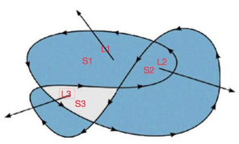

# canvas

## 简介

+ canvas最早由Apple引入WebKit，用于Mac OS X 的Dashboard，后来又在Safari和Google Chrome中实现

+ 基于gecko 1.8浏览器，比如Firefox 1.5，同样支持这个元素

+ canvas元素是WhatWG Web application 1.0的一部分，也包含于HTML5

+ H5的canvas元素使用JavaScript在网页上绘制图像，默认大小是300*150，可以自主设置宽高，不建议设置在style样式中

+ 浏览器解析的时候是图片，可以控制每一像素

+ canvas不是块级元素，所以居中的时候需要用display转化一下

+ canvas拥有多种绘制路径、矩形、圆形、字符以及添加图像的方法

## 绘制步骤

+ 先获取元素，之后获取工具，再设置起始位置，之后绘制路径，最后描边

+ 描边过程可以设置线条颜色

+ 再次绘制的时候会使用之前的样式，后面的样式覆盖前面的

  ```html
  ...
  <style>
    canvas{
      border: 1px solid #ccc;
      /*不建议在这里设置宽高*/
      /*width: 600px;
      height: 300px;*/
    }
  </style>
  ...
  <body>
  <canvas height="300" width="600"></canvas>
  <script>
    //获取canvas元素
    var canvas=document.querySelector('canvas');
    //获取绘制环境（工具）
    var ctx=canvas.getContext('2d');
    //设置起始绘图的位置
    ctx.moveTo(100,100);
    //绘制路径
    ctx.lineTo(200,100);
    //描边
    ctx.stroke();
  </script>
  </body>

  ```

## 绘制

### 基本绘制

- 线默认是1px，黑色。canvas由像素点组成，以坐标的中心绘制。如果是1px的线条，会被坐标中心分成两部分，每部分0.5px，浏览器无法显示0.5px，所以显示成浅色的粗线条。
- 如果线条的宽度是偶数的，就不会有这种情况。不过这种效果一般可以忽略。
- beginPath表示重新绘制一条线，后面没有设置的样式会沿袭前边线条的样式
- 手动闭合，会产生缺口效果
- 自动闭合closePath
- 填充fill
- 不管是手动闭合还是自动闭合，或者是不封闭，都不会影响填充效果
- 两端样式用lineCap属性设置，默认是butt，还有round和square值，设置成后两种的时候，线条会比默认稍长 
- 设置moveTo和lineTo，形成拐点，默认样式是miter，还有round和bevel值
- 渐变可以看成，线条中的每个像素分别设置颜色。那么渐变效果用遍历线条中的每个像素就可以实现
- 遍历一次，线条的起点moveTo和lineTo就会发生改变

#### 线条

```javascript
/*1.获取canvas元素*/
var canvas = document.querySelector('canvas');
/*2.获取绘制环境  （获取绘制工具）*/
/*content内容  context 上下文 */
var ctx = canvas.getContext('2d');
/*3.设置起始绘图的位置*/
ctx.moveTo(100,100);
/*6.设置宽度*/
ctx.lineWidth = 10;
/*4.绘制路径 */
ctx.lineTo(200,100);
/*7. 设置描边的颜色*/
ctx.strokeStyle = 'red';
/*5.描边*/
ctx.stroke();
```

#### 平行线

```javascript
/*1.获取canvas元素*/
var canvas = document.querySelector('canvas');
/*2.获取绘制环境  （获取绘制工具）*/
/*content内容  context 上下文 */
var ctx = canvas.getContext('2d');
/*3.设置起始绘图的位置*/
ctx.moveTo(100,100);
/*6.设置宽度*/
ctx.lineWidth = 10;
/*4.绘制路径 */
ctx.lineTo(200,100);
/*7. 设置描边的颜色*/
ctx.strokeStyle = 'red';
/*5.描边*/
ctx.stroke();
/*绿色*/
/*再次绘制的时候     会使用之前设置的样式   设置的样式最后的会生效*/
/*开启新路径*/
ctx.beginPath();
ctx.moveTo(100,200);
ctx.lineTo(200,200);
ctx.strokeStyle = 'green';
ctx.stroke();
```

#### 三角形

```javascript
var canvas  = document.querySelector('canvas');
/*获取绘图工具*/
var ctx = canvas.getContext('2d'); /*3d目前还不支持*//*webgl*/
/*移动画笔*/
ctx.moveTo(100,100);
ctx.lineTo(200,100);
ctx.lineTo(200,200);
//ctx.lineWidth = 10;
/*自动闭合*/
ctx.closePath();
//ctx.stroke();
//ctx.strokeStyle = 'red';
//ctx.stroke();
/*填充*/
//ctx.fillStyle = 'red';
ctx.fill();
```

#### 镂空矩形

```javascript
var canvas  = document.querySelector('canvas');
var ctx = canvas.getContext('2d');
/*1.获取画布的宽度和高度*/
//var width = canvas.width;
var width = ctx.canvas.width;
var height = ctx.canvas.height;
/*2.假设大容器  200*200*/
/*3.假设小容器  100*100*/
/*4. 计算起始位置*/
var x = width/2 - 100;
var y = height/2 -100;
ctx.moveTo(x,y);
ctx.lineTo(x+200,y);
ctx.lineTo(x+200,y+200);
ctx.lineTo(x,y+200);
ctx.lineTo(x,y);
/*第二个方形的方向需要是逆方向*/
var x1 = width/2 - 50;
var y1 = height/2 -50;
ctx.moveTo(x1,y1);
ctx.lineTo(x1,y1+100);
ctx.lineTo(x1+100,y1+100);
ctx.lineTo(x1+100,y1);
ctx.lineTo(x1,y1);
ctx.stroke();
ctx.fill();
```

#### 线两端

```javascript
var canvas  = document.querySelector('canvas');
/*获取绘图工具*/
var ctx = canvas.getContext('2d'); /*3d目前还不支持*//*webgl*/

ctx.lineWidth = 10;
ctx.moveTo(100,100);
ctx.lineTo(200,100);
ctx.strokeStyle = 'red';
ctx.lineCap = 'butt';
ctx.stroke();

ctx.beginPath();
ctx.moveTo(100,200);
ctx.lineTo(200,200);
ctx.strokeStyle = 'green';
ctx.lineCap = 'round';
ctx.stroke();

ctx.beginPath();
ctx.moveTo(100,300);
ctx.lineTo(200,300);
ctx.strokeStyle = 'pink';
ctx.lineCap = 'square';
ctx.stroke();
```

#### 线拐点

```javascript
var canvas  = document.querySelector('canvas');
/*获取绘图工具*/
var ctx = canvas.getContext('2d'); /*3d目前还不支持*//*webgl*/

ctx.lineWidth = 10;
ctx.moveTo(100,100);
ctx.lineTo(150,150);
ctx.lineTo(200,100);
ctx.strokeStyle = 'red';
ctx.lineJoin = 'miter';
ctx.stroke();

ctx.beginPath();
ctx.moveTo(100,200);
ctx.lineTo(150,250);
ctx.lineTo(200,200);
ctx.strokeStyle = 'green';
ctx.lineJoin = 'round';
ctx.stroke();

ctx.beginPath();
ctx.moveTo(100,300);
ctx.lineTo(150,350);
ctx.lineTo(200,300);
ctx.strokeStyle = 'pink';
ctx.lineJoin = 'bevel';
ctx.stroke();
```

#### 渐变线

```javascript
var canvas  = document.querySelector('canvas');
/*获取绘图工具*/
var ctx = canvas.getContext('2d'); /*3d目前还不支持*//*webgl*/
/*1.从左到右*/
/*2.起始颜色  白色*/
/*3.结束颜色  红色*/
ctx.lineWidth = 10;
for (var i = 0; i < 255; i++) {
  ctx.beginPath();
  ctx.moveTo(99+i,100);
  ctx.lineTo(100+i,100);
  var g = 255 - i;
  var b = 255 - i;
  ctx.strokeStyle = 'rgb(255,'+g+','+b+')';
  ctx.stroke();
}
```

#### 虚线

- 用setLineDash设置虚线


- 传入一个数组，数组中的数据依次表示实点空白
- 如果传入的是奇数个数据，比如5,10,15，
- 那么表示实点5、空白10、实点15、空白5、实点10、空白15
- 奇数总会转换成偶数个数据
- 另外虚线还有偏移量，负值表示向右偏移

```javascript
var canvas  = document.querySelector('canvas');
/*获取绘图工具*/
var ctx = canvas.getContext('2d'); /*3d目前还不支持*//*webgl*/
ctx.moveTo(100,100);
ctx.lineTo(500,100);
/*绘制虚线的方法*/
/*传数组  设置虚线长度的*/
ctx.setLineDash([5,10]);
/*offset表示位移*/
ctx.lineDashOffset=5;
/*如果是偶数个数设置  */
/*如果是奇数数个数设置     */
/*获取的不重复的一段*/
console.log(ctx.getLineDash());
ctx.stroke();
```


### 非零绘制原则

* 从某区域伸出一条线，经过这条线的路径，顺时针方向+1，逆时针方向-1。最终路径值的和是0，则这个区域就不填充。
* S1区域，L1伸出来，与一条线交叉，这条线是逆时针，-1
* S2区域，L2伸出来，与两条线交叉，两条线都是逆时针，-1+(-1)=-2
* S3区域，L3伸出来，与两条线交叉，一条是逆时针，一条是顺时针。-1+(+1)=0
* 非零填充，为零不填充




### 矩形

* 所有的方法中，前两个参数表示相对于canvas坐标，x和y，后两个参数表示矩形的大小，长和宽
* rect没有自己独立的路径，设置完坐标和大小时候，还需要手动描边或填充
* strokeRect和fillRect都有自己的路径，可以直接生成矩形，一个标识描边生成，另一个是填充生成
* clearRect清除绘制内容

```javascript
var canvas=document.querySelector('canvas');
var ctx=canvas.getContext('2d');
ctx.rect(100,100,20,100);
ctx.strokeRect(200,100,20,100);
ctx.fillRect(300,100,20,100);
ctx.clearRect(210,100,20,100);
ctx.stroke();
```

### 渐变方案

* createLinearGradient前两个参数表示起点的坐标，后两个参数表示终点坐标
* addColorStop表示颜色的设置，第一个参数表示占据位置，第二个参数是颜色

```javascript
var canvas = document.querySelector('canvas');
var ctx = canvas.getContext('2d');
/*渐变的方案*/
var linearGradient = ctx.createLinearGradient(100,150,300,150);
/* 0-1  0-100%  */
linearGradient.addColorStop(0,'red');
linearGradient.addColorStop(0.5,'blue');
linearGradient.addColorStop(1,'yellow');
ctx.fillStyle = linearGradient;
ctx.fillRect(100,100,200,100);
```

### 曲线

```javascript
var canvas = document.querySelector('canvas');
var ctx = canvas.getContext('2d');
/*1.线都是由点构成*/
var yy = 0;
for (var i = 0; i < 600; i++) {
  var x = i;
  /*y会随着公式去计算*/
  //var y = 2*x;
  var y = Math.pow(x+2,2);
  //var y = Math.sin(x/20)*100 + 300;
  ctx.beginPath();
  ctx.moveTo(x,yy);
  ctx.lineTo(x+1,y);
  yy = y;
  ctx.stroke();
}
```

### 圆弧

* 圆弧绘制arc方法有六个参数
* 前两个参数表示圆心的坐标，第三个参数表示圆弧的半径，第四个参数表示开始的弧度，第五个参数表示结束的弧度，第六个参数表示绘制方向，默认值是false顺时针
* 一个弧度的长度等于半径的长度，一个周长等于2*π个弧度
* 周长是2*Math.PI*r，一个角度就是Math.PI/180
* 顺时针转是正方向，是正值。逆时针转是负方向是负值

```javascript
var canvas=document.querySelector('canvas');
var ctx=canvas.getContext('2d');
ctx.arc(100,100,60,0,2*Math.PI,false);
ctx.stroke();
```

### 文本

* 文本设置，font设置字体样式和大小
* strokeText表示字体描边，fillText表示字体填充，这两个方法有四个参数，第一个参数表示要表示出来的文本，第二个和第三个参数表示坐标（文本的左下角），第四个参数表示文本最大宽度，可以不设置
* textAlign表示文本左右方向的对齐方式，有left，right，center，start，end...
* textBaseline表示文本上下的对齐方式，有top，middle，bottom，alphabetic（默认值）
* measureText方法获取文本的宽度
* 文本的对齐都是相对于坐标点来确定的
* 如果设定起始点的坐标是(100,100)那么向右对齐的时候，文本会出现在(100,100)的左边，上下方式的对齐方式同理

```javascript
var canvas=document.querySelector('canvas');
var ctx=canvas.getContext('2d');
ctx.font = '微软雅黑'
ctx.stroke();
ctx.fillText('内容内容',100,100,150);
```

### 图片

* 创建一个存在于内存中的图片，有下面两种方式
* 文档中创建元素，设定元素的路径等属性
* 使用Img对象new一个图片
* 在IE浏览器中，图片加载之后会有缓存，在onload的时候图片可能已经加载出来了，所以要把获取图片的语句放在onload之后
* canvas中绘制图片有三种方式
  + 第一种，三个参数
    + 参数一，图片对象。参数二，坐标x。参数三，坐标y。
  + 第二种，五个参数
    + 参数一，图片对象。参数二，坐标x。参数三，坐标y。参数四，图片宽。参数五，图片高。
  + 第三种，九个参数
    + 参数一，图片对象。参数二，图片x轴定位。参数三，图片y轴定位。参数四，截取图片宽度。参数五，截取图片高度。参数六，绘制x坐标。参数七，绘制y坐标。参数八，绘制图片宽度。参数九，绘制图片高度。

```javascript
/*img元素也有onload事件*/
/*document.querySelector('img').onload = function () {
        console.log('加载完成');
    }*/
/*怎么动态创建一个图片元素*/
/*这个元素在内存里面*/
var img = document.createElement('img');
img.src = 'images/01.jpg';
img.onload = function () {
  console.log(img);
}
/*使用Image对象*/
var img1 = new Image();
img1.onload = function () {
  console.log(img1);
}
img1.src = 'images/01.jpg';
/*补充：兼容问题*/
/*IE onload必须先绑定*/
```

### 精灵图

  * 从一大张精灵图中截取需要的部分
  * 获取画布的宽高，令图片居中显示
  * 九个参数中，获取img对象，在图片的(40,195)的位置截取图片，截取图片的大小是40X65，放在画布的(startX,startY)的位置，在画布中显示大小是40X65

```javascript
var canvas = document.querySelector('canvas');
var ctx = canvas.getContext('2d');
var img = new Image();
img.onload = function () {
  var width = ctx.canvas.width;
  var height = ctx.canvas.height;
  var startX = width/2-20;
  var startY = height/2-32.5;
  /*绘制*/
  ctx.drawImage(img,40,195,40,65,startX,startY,40,65);
}
img.src = 'images/03.png';
```


### 帧动画

  * 获取画布大小，获取人物大小，得到绘制的起点
  * 设置索引值初始值为0，代表行列中的第几个图片
  * 绘制图片，在图片(0,0)位置截取图片，截取大小是人物大小，画布中绘制起点就是之前计算得到的结果，图片大小是人物大小。
  * 设置一个定时器，令index自加，如果index加到3，归零
  * 绘制图片之前先清除之前的图片，清除的起点是绘制图片的起点，清除范围的大小是人物的大小
  * 绘制新图片，截取位置的x方向长度是索引和人物宽度的乘积，y方向就是最后一行的坐标195，图片截取大小就是人物大小，开始位置就是绘制起始位置，画布中图片显示大小就是人物大小

```javascript
var canvas = document.querySelector('canvas');
var ctx = canvas.getContext('2d');
var img = new Image();
img.onload = function () {
  /*画布大小*/
  var width = ctx.canvas.width;
  var height = ctx.canvas.height;
  /*人物大小*/
  var perWidth = img.width/4;
  var perHeight = img.height/4;
  /*绘制起点*/
  var startX = width/2-perWidth/2;
  var startY = height/2-perHeight/2;
  /*绘制*/
  /*图片的索引*/
  var index = 0;
  ctx.drawImage(img,0,0,perWidth,perHeight,startX,startY,perWidth,perHeight);
  setInterval(function () {
    index ++;
    if(index > 3){
      index = 0;
    }
    /*绘制之前清除之前的图片*/
    ctx.clearRect(startX,startY,perWidth,perHeight);
    ctx.drawImage(img,index*perWidth,195,perWidth,perHeight,
                  startX,startY,perWidth,perHeight);
  },100);
}
img.src = 'images/03.png';
```

### 转换坐标轴

  * CSS中translate 在移动的是元素
  * Canvas中 translate移动的事坐标轴
  * CSS中rotate旋转绕元素中心转，坐标轴方向发生改变
  * Canvas中 rotate旋转绕坐标轴原点，坐标轴方向发生改变
  * Canvas 中scale x轴的缩放 y轴的缩放 并不是元素的缩放

### 保存和恢复

  * 保存和恢复，保存多个系列，先保存的后被拿出，后保存的先被拿出。栈
  * 如果先保存一个红色宽30，再保存一个绿色宽20，之后恢复的时候，会先恢复

```javascript
var canvas = document.querySelector('canvas');
var ctx = canvas.getContext('2d');

ctx.lineWidth = 30;
ctx.strokeStyle = 'red';
ctx.moveTo(100,100);
ctx.lineTo(300,100);
ctx.stroke();
/*保存一系列样式*/
/*保存多个系列样式*/
/*存储结构是栈  后进先出*/
ctx.save();

ctx.beginPath();
ctx.lineWidth = 20;
ctx.strokeStyle = 'green';
ctx.moveTo(100,200);
ctx.lineTo(300,200);
ctx.stroke();
ctx.save();

ctx.beginPath();
ctx.restore();
ctx.moveTo(100,300);
ctx.lineTo(300,300);
ctx.stroke();

ctx.beginPath();
ctx.restore();
ctx.moveTo(100,400);
ctx.lineTo(300,400);
ctx.stroke();
```

## 实例

### 刮刮乐

```javascript
var canvas = document.querySelector('canvas');
var ctx = canvas.getContext('2d');

var img = new Image();
img.onload = function () {
  /*填充方案*/
  var pat = ctx.createPattern(img,'no-repeat');
  /*图片描边*/
  ctx.strokeStyle = pat;
  /*设置线的样式*/
  ctx.lineWidth = 25;
  ctx.lineCap = 'round';
  ctx.lineJoin = 'round';
  var isDown = false;
  ctx.canvas.addEventListener('mousedown',function (e) {
    /*设置起始坐标*/
    ctx.moveTo(e.clientX,e.clientY);
    isDown = true;
  })
  ctx.canvas.addEventListener('mousemove',function (e) {
    if(isDown){
      ctx.lineTo(e.clientX,e.clientY);
      ctx.stroke();
    }
  })
  ctx.canvas.addEventListener('mouseup',function () {
    isDown = false;
  })
}
img.src = 'images/05.jpg';

```

### 键盘控制人物移动

```javascript
var Per = function () {
  this.ctx = document.querySelector('canvas').getContext('2d');
  this.width = this.ctx.canvas.width;
  this.height = this.ctx.canvas.height;
  this.stepSize = 10;
  this.index = 0;
}
Per.prototype.init = function () {
  var that = this;
  that.loadImage(function (img) {
    that.perWidth = img.width/4;
    that.perHeight = img.height/4;
    that.startX = that.width/2-that.perWidth/2;
    that.startY = that.height/2-that.perHeight/2;
    that.drawPer(img,0,0,0);
    that.bindEvent(img);
  })
}
/*图片加载*/
Per.prototype.loadImage = function (callback) {
  var img = new Image();
  img.onload = function () {
    /*完成其他业务*/
    callback && callback(img);
  }
  img.src = 'images/04.png';
}
/*事件绑定*/
Per.prototype.bindEvent = function (img) {
  var that = this;
  /*按键编码 左上右下 37 38 39 40*/
  /* 0 1 2 3*/
  var direction = 0;
  var stepX = 0;
  var stepY = 0;
  document.addEventListener('keydown',function (e) {
    console.log(e.keyCode);
    switch(e.keyCode){
      case 37:
        /*左*/
        stepX --;
        direction = 1;
        break;
      case 38:
        /*上*/
        stepY --;
        direction = 3;
        break;
      case 39:
        /*右*/
        stepX ++;
        direction = 2;
        break;
      case 40:
        /*下*/
        stepY ++;
        direction = 0;
        break;
    }
    that.index ++;
    /*绘制*/
    that.drawPer(img,stepX,stepY,direction);
  })
}
/*绘制人物*/
Per.prototype.drawPer = function (img,stepX,stepY,direction) {
  /*清空*/
  this.ctx.clearRect(0,0,this.width,this.height);
  if(this.index > 3){
    this.index = 0;
  }
  /*绘制*/
  this.ctx.drawImage(img,this.perWidth*this.index,direction*this.perHeight,
                     this.perWidth,this.perHeight,
                     this.startX+(stepX*this.stepSize),this.startY+(stepY*this.stepSize),
                     this.perWidth,this.perHeight);
}
new Per().init();

```

