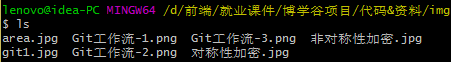

# git的使用和操作

## shell

- 在计算机科学中，Shell俗称壳，用来区别于Kernel（核），是指“提供使用者使用界面”的软件（命令解析器）。它类似于DOS下的command和后来的cmd.exe。它接收用户命令，然后调用相应的应用程序。

- 图形界面shell：通过提供友好的可视化界面，调用相应应用程序，如windows系列操作系统，Linux系统上的图形化应用程序GNOME、KDE等。

- 命令行shell：通过键盘输入特定命令的方式，调用相应的应用程序，如windows系统的cmd.exe、Windows PowerShell，Linux系统的Bourne shell ( sh)、Bourne Again shell ( bash)等。

- API，application programming interface应用程序编程接口

## bash常用规则

### pwd

查看当前目录

 

### cd

切换目录，如cd /etc

 

### ls

查看当前目录下的内容，如ls -al，./表示当前目录，../表示上一级目录

ls表示当前目录下的文件

 

ls -a表示当前目录下所有的文件，包括./当前目录 ../上一级目录

 

ls -l表示当前目录下所有文件的详细信息，不包括./和../

 

ls -al是上面两种情况的集合

 

ls ./表示当前目录的文件

ls ../表示上一级目录的文件

### mkdir

创建目录，如mkdir blog

 

### touch

创建文件，如touch index.html

 

### cat

查看文件的全部内容，如cat index.html

 

### less

查看文件，如more /etc/password，less /etc/password

less命令f向前一页，b向后一页，回车每次走一行，q退出

 

### rm

删除文件，如rm index.html，rm -rf blog

-rf表示全部删除，强制删除文件夹，在DOS窗口也可以用

 

### rmdir

删除文件夹，只能删除空文件夹

 

### mv

移动文件到指定的目录或重命名，如mv index.html ./demo/index.html

 

### cp

复制文件到指定的目录，cp index.html ./demo/index.html

 

### tab

自动补全，连按两次会将所有匹配内容显示出来

### 重定向 

\>覆盖 

 

\>>追加

 

### 管道符

可以将多个命令连接使用，上一次结果是下一次的参数

### grep

匹配内容，和管道符连用

### tail

不加参数默认从末尾开始显示，加上数字参数，表示文件从倒数第几行开始显示

 

## vi编辑器

- Linux操作系统标配，相当于window下的记事本

- vi常用操作
  - 打开/创建文件，vi 文件路径
  - vi也可以创建新文件，vi文件名之后进入末行模式保存
  - Window中后缀有意义，在Linux中后缀没有意义
  - 输入模式和末行模式不能直接切换
- 末行模式（底行模式）
  - :w保存，:w filename另存为
  - :q退出，:wq保存并退出
  - :e! 撤销更改，返回到上一次保存的状态，:q! 不保存强制退出
  - :set nu 设置行号
- 命令行模式
  - ZZ（大写）保存并退出，u辙销操作可多次使用
  - dd删除当前行，yy复制当前行，p 粘贴内容
  - ctrl+f向前翻页，ctrl+b向后翻页
  - i进入编辑模式，当前光标处插入
  - a进入编辑模式，当前光标后插入
  - A进入编辑模式，光标移动到行尾
  - o进入编辑模式，当前行下面插入新行
  - O进入编辑模式，当前行上面插入新行

## 版本控制

- 本地式版本控制，集中在一台电脑，不方便，电脑损坏就容易丢失，不会覆盖

  

- 集中式版本控制，放在一个服务器，不会覆盖原来的东西，不局限于一台电脑，服务器坏了或者网络断了，就不能用了，流行SVN

  

- 分布式版本控制，放在服务器，不局限一个电脑，电脑之间可以共享，断网或者服务器坏了，电脑之间也会相互访问，管理不同代码的合并，git，方便团队开发过程中代码的合并，能够保存所有的历史记录，方便随时回滚，保存作者信息

  

## 工作原理

### 三个工作区域

- 工作目录（.git所在的目录，用来存储当前代码）
- 暂存区域（git临时存储代码）
- 本地仓库（存储整个项目的快照）

### 四种工作状态

- 未追踪untraced
- 已暂存staged
- 已提交commited
- 已修改modified

### 工作流程

- 配置用户信息：
  - git config --global user.name "自已的名字"
  - git config --global user.email "自已的邮箱地址"
- 初始化仓库：git init
- 添加文件到暂存区：git add 文件名/ 文件路径 “*”或-A代表所有
- 提交文件：commit -m “注释内容”
- 查看文件状态：git status
- 查看提交历史：git log

## 回滚

### 用git reset的方式回滚

- --hard回滚本地的仓库快照，覆盖暂存区工作区
- --soft只会回滚本地仓库的快照，不会覆盖暂存区工作目录
- --mixed（默认）回滚本地仓库的快照，并且覆盖暂存区，但是不覆盖工作目录
- 之后跟上要回滚到的commit的id前几位就可以了
- HEAD表示本地仓库的最新快照
- ^表示上一次快照，多个^的时候以此类推
- 当commit的次数过多的时，git log 显示不完全，想要退出这个命令行需要手动输入q

### 回滚最后一次提交

- 取消最后一次提交的操作
- git reset --hard HEAD^
- git reset --hard 倒数第二个commitID

### git add的逆操作

- 二次add的逆操作
- git add是从工作区域到暂存区，add的逆操作是从暂存区到工作区域，就是工作区的内容不变，删掉暂存区中的内容
- git reset --mixed HEAD
- git reset HEAD
- git reset 最后一次commitID
- git rm --cached 文件列表

### 回滚所有修改操作

- 用暂存区覆盖工作目录，工作目录的内容发生改变
- git checkout 文件列表
- git checkout **.**** **回滚所有

## 分支

- master就是分支名，默认只有一个分支，就是master，主分支
- 查看分支名git branch -a(所有分支) -r(远程分支)
- 创建分支git branch 分支名称 
- 切换分支git checkout 分支名称
- 合并分支git merge 分支名称（来源分支）
- 一个分支就是主分支的副本
- 删除分支git branch -d 分支名称，分支必须被合并过才能删除
- 强制删除分支git branch -D 分支名称
- 创建并切换分支git checkout -b 分支名称
- 删除远程分支git push origin --delete 分支名称
- 删除远程分支git push origin :分支名称
- 推送分支的时候，push加远程仓库的地址后面要跟上分支名称

## 远程仓库

### 上传

- git push 远程仓库的地址 本地分支名称：远程分支名称
- git push 远程仓库的地址 本地分支名称

### 下载

- git pull 远程仓库的地址 远程分支的名称：本地分支的名称
- git pull 远程仓库的地址 远程分支的名称
- 第一次获取代码用clone
- git clone 远程仓库的地址 项目名称（可选的）

## 远程登录

- telent一种不加密的通信协议
- ssh一种协议，用来实现两台计算机之间的通信（远程登录）
- 有下面两种登录方法
  - 使用密码登录：客户端向服务器发送请求；服务器收到请求之后向客户发送自己的公钥；客户端收到公钥之后保存到指定目录；客户端输入密码然后公钥加密再次发送请求；服务器接收到密文之后，用私钥解码然后验证通过，从而允许客户端登录
  - 使用公钥和私钥登录：客户端生成自己的公钥私钥（ssh-keygen -t rsa）；把客户端的公钥传递给服务器，服务器使用公钥给客户端授权；客户端就可以直接免密登录了

## 不被管理

- 如果有希望不被git管理的文件，单独建立一个.gitignore文件，将不被管理的文件的名称放进去就可以了
- window系统中不允许创建没有前缀的文件，所以可以通过touch方法
- 在.gitignore文件中加入需要被忽略的文件的名称

## 现场

- 添加一部分内容之后，在不能提交的情况下又需要去完成另一个任务，这时候可以用保存现场的方式git stash
- 保存之后，文件恢复原状，保持没有报错，已经被提交过的状态
- 对另外的任务进行处理
- 提交之后，再恢复现场git stash pop

## 比较

- 比较工作区和暂存的差异git difftool
- 比较与特定提交的差异git difftool 快照id
- 比较某两次提交的差异git difftool 快照id 快照id
- 比较某个分支的差异git difftool 分支名称

