# Node.js

## 简介

### 相关文章

- [JavaScript——历史与简介](http://www.cnblogs.com/ghost-xyx/p/4035615.html)
- [深入浅出Node.js（一）：什么是Node.js](http://www.infoq.com/cn/articles/what-is-nodejs/)
- [I/O事件概述](http://www.cnblogs.com/eric-nirnava/p/IO.html)
- [理解Node.js事件驱动编程](http://www.cnblogs.com/lua5/archive/2011/02/01/1948760.html)
- [Node.js 中文网](http://nodejs.cn/api/documentation.html)
- [Node.js 英文官网](https://nodejs.org/en/)
- [Node.js 菜鸟教程](http://www.runoob.com/nodejs/nodejs-tutorial.html)
- [CNode：Node.js专业中文社区](https://cnodejs.org/)
- [深入浅出Node.js(朴灵)完整扫描版.pdf](http://download.csdn.net/download/u010733705/9555797)
- [HTTP Keep-Alive是什么？如何工作？](http://www.nowamagic.net/academy/detail/23350305)
- [浏览器User-agent String里的历史故事](http://www.nowamagic.net/librarys/veda/detail/2576)
- [art-template API](https://aui.github.io/art-template/docs/api.html)
- [yarn与npm的命令行小结](http://www.jb51.net/article/95199.htm)
- [nodejs的历史由来](http://blog.csdn.net/u012028371/article/details/54884056)
- [art-template官方文档](https://aui.github.io/art-template/docs/)
- [博客园官网](https://www.cnblogs.com/)
- [art-template 官方文档](https://aui.github.io/art-template/)
- [ES6 - 模板字符串](http://www.infoq.com/cn/articles/es6-in-depth-template-string)
- [js中的数组对象排序](http://www.cnblogs.com/xljzlw/p/3694861.html)
- [i5ting/tocmd.npm 将MD转换为HTML](https://github.com/i5ting/tocmd.npm)
- [JavaScript 语句后应该加分号么？](https://www.zhihu.com/question/20298345)
- [art-template官方文档中文](https://aui.github.io/art-template/zh-cn/index.html)
- [felixge/node-formidable](https://github.com/felixge/node-formidable)
- [Node中使用 302 重定向](https://stackoverflow.com/questions/4062260/nodejs-redirect-url)
- [Nodejs基础：路径处理模块path总结](http://www.cnblogs.com/chyingp/p/node-learning-guide-path.html)
- [FormData 对象的使用](https://developer.mozilla.org/zh-CN/docs/Web/API/FormData/Using_FormData_Objects)
- [深入浅出ES6（六）：解构 Destructuring](http://www.infoq.com/cn/articles/es6-in-depth-destructuring/)
- [MDN - Array.prototype.some()](https://developer.mozilla.org/zh-CN/docs/Web/JavaScript/Reference/Global_Objects/Array/some)
- [URL中的hash（井号）](http://www.cnblogs.com/joyho/articles/4430148.html)

### Node.js 的起源

  - 作者，之前主要是做高性能服务器维护的，高性能的服务器必须要是异步非阻塞的**、**基于事件驱动的。

  - 作者在分析了上面两条基本条件之后，就开始研发高性能服务器。

  - 对于程序员来说，如果同时提供了同步和异步两种编程方式，程序员肯定会选择同步。

  - 作者选择Javascript最主要的原因，就是这门语言是单线程的

  - 多线程：程序员能主动开启子线程的语言，就叫做多线程的语言。Thread td = new Thread();

  - 作者最终选择的语言是Javascript，解析引擎是V8，免费、开源、由谷歌团队进行维护更新。

  - 刚开始，作者写出来的这个东西叫做web.js。后来，随着项目扩大和功能的完善，作者发现这款产品，不仅能做高性能的服务器，还能做许多事情，比如可以用这个东西去做前端包管理；于是就改名叫做Node.js。

### 功能

- Node可以作为前端的一个工具去使用，通过NPM安装好用的工具，Node可以开发一些前端的工具。比如i5ting_toc可以将md文件转换成html文件。
- Node能做服务器
- Node还可以操作数据库并对外提供数据接口

### 前端和后端

- 前端主要工作：写页面、样式、JS特效、和后端的数据交互、借助于一些前端的框架实现SPA应用。前端主要负责页面展示性的东西，用户所能看到的任何东西，都是前端的工作。


- 后端主要工作：操作数据库、给前端暴露数据接口。


- 前后端协作流程：后端为我们暴露接口、前端根据后端提供的数据接口API和文档、进行页面数据的渲染。


- 在公司中配环境：自己用的顺手的编辑器，安装下Node和NPM，安装Git或SVN，浏览器。下载代码到本地。
- 3天左右的时间熟悉项目（后端架构（Java、.NET、PHP）、前端的架构（NG、Vue、React、Jquery+AJax+模板引擎）、业务（熟悉业务、如果不熟悉，就要问相关负责人）、技术）


### 三者比较

- ECMAScript：语言规范，定义了如何定义变量、分支语句、函数、对象、内置对象；（ECMAScript语言规范就是一本书，这本书中，通过详细的规范，定义了这门语言中一些必要的特性；）


- 浏览器中的Javascript组成部分：DOM +  BOM + ECMAScript核心


- Node中的Javascript：Node中的JS，剔除了浏览器中扩展的DOM和BOM这两套API，在Node中，没有浏览器的概念，所以Node不需要DOM 和 BOM， Node中只有一个V8JS解析引擎。


- Node中的Javascript组成部分：ECMAScript核心 + 核心API模块 + 一些第三方API模块

### 概念

- Node.js 是一个基于 Chrome V8 引擎的 JavaScript 运行环境。


- 我们使用JS写的Node代码，只是单纯的字符串而已。
- 如果想要执行这些写好的代码，必须要有一个解析执行环境，这个环境就是chrome 的 V8 引擎。


- Node.js 使用了一个事件驱动、非阻塞式 I/O 的模型，使其轻量又高效。


- 事件驱动：当触发某个事件的时候，执行事件中指定的代码。
- 非阻塞式 I/O 的模型：采用非阻塞的操作，能够提高CPU处理的效率，代码表现形式是，会经常写回调函数。


- Node.js 的包管理器 npm，是全球最大的开源库生态系统。


- npm由两层含义：首先它表示NPM的官网。其次，表示NPM这个包管理工具。

## 安装与运行

  - 先使用npm init -y初始化一下包管理文件package.json，将来所有安装的包，都会记录到这个文件中。-y表示默认，不会有一坨问答。必须要先初始化一下 文件才会被下载到当前目录，否则下载到用户名下的根目录。

    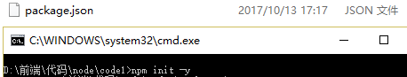

  - 使用npm install 包名 --save/--save-dev去安装包，其中，install可以简写成i。如下图，jQuery文件中还有package.json表示jQuery还有需要依赖的文件。

    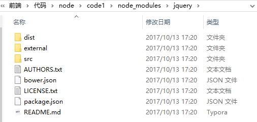

  - --save表示把包安装到部署依赖中（在开发和部署上线都需要使用的包）， --save-dev表示安装到开发依赖（只在项目开发阶段需要用到的包）。

  - --save可以简写成-S，--save-dev可以简写成-D;

  - 删除包npm uninstall 包名 --save/--save-dev或者npm remove 包名 --save/--save-dev。

  - npm i webpack -g,其中，-g表示全局安装某些包，通过-g安装的包都在C:\Users\用户名\AppData\Roaming\npm下面

  - 使用 -g 安装的包都存放到了C:\Users\自己的用户名\AppData\Roaming\npm目录中。

  - 全局安装的包可以通过 cmd 命令行在任何地方使用；

  - 如果只需要安装项目运行的依赖，排除gulp等体积巨大只在开发阶段用到的文件，可以运行npm i --production。


- NPM 和 Github（码云） 和 Git之间的关系
  - NPM是包管理平台（里面托管了各种各样的第三方包）
  - Github、码云是代码托管平台（托管了各种各样的代码仓库）
  - Git是用来对代码进行分支版本管理


- 总结：Node.js 就是一个Javascript的服务端运行环境（依赖于Chrome 的V8引擎解析执行JS代码），为Javascript提供了服务器端编程的能力。


- ​

### 两种运行方式

- 直接在命令行中输入node，进入Node的REPL运行环境。
  - R：Read：读取用户输入的字符串内容
  - E：Evaluate：把用户输入的字符串，当作JS代码去解析执行
  - P：Print：打印输出Evaluate解析的结果
  - L：Loop：进入下一次循环

  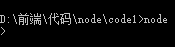


- 将Node代码写入到一个js文件中，然后通过命令行输入，node 要执行的JS文件路径，去运行Node代码

  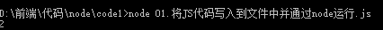

### 环境变量

- Path环境变量的作用：能够让我们通过命令行的形式 快速启动一个应用程序。


- 用户变量和系统变量的区别
  - 用户变量：用户变量是属于每一个用户的，用户之间的用户变量是私有的，不共享的。

  - 系统变量：系统变量是共享的，只能用户能够登录这台电脑，那么就能访问系统变量中的任何东西，将来在配置环境变量的时候，推荐大家配置到系统变量中。

    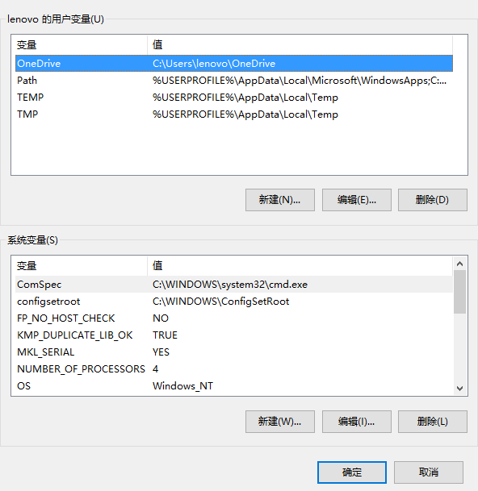


- 配置环境变量的两种方式
  - 第一种方式：直接把路径添加到path环境变量中。
  - 第二种方式：先在环境变量中创建一个新变量，名字类似于：ZOOM_HOME这样，值是我们程序的根目录；然后，再把这个变量名，引用到 Path环境变量中，类似于：%ZOOM_HOME%


- Path变量的查找规则
  - 先从当前的目录中查找有没有这个应用程序，如果有，则直接运行，如果没有，则去系统环境变量中，path环境变量下挨个查找对应的文件夹，如果在对应文件夹中能找到，则直接运行，如果找不到，最终报错。

## 操作

### 初始操作

- 在node，如果要使用核心模块，实现某些功能

- 使用require('核心模块标识符')，导入需要的模块。
- 通过官方提供的API，调用模块中对应的方法，实现我们的功能

### os模块

- 用来查看CPU信息

```javascript
var os=require('os');//导入核心模块
var result=os.cpus();
console.log(result);
```

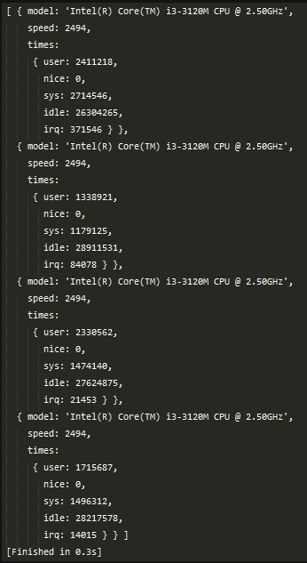

### fs模块

#### 用来操作文件

- fs.readFile

  - 参数1： 要读取文件的路径，string类型

  - 参数2： 可选，执行要以哪种编码格式读取指定的文件内容，string类型

  - 参数3： 回调函数， 表示当文件读取OK之后，执行什么进一步操作

    ```javascript
    var fs = require('fs');//使用 require 导入 fs 系统模块
    fs.readFile( __dirname + '/info.txt', 'utf-8', function (err, dataStr) {
      /*if (err) {
        // 报错了
        console.log('读取文件失败，错误消息为：' + err.message);
      } else {
        // 成功了
        console.log(dataStr);
      }*/
      if (err) return console.log('读取文件失败，错误消息为：' + err.message);
      console.log(dataStr);
    });
    console.log(__dirname)
    console.log(__filename)
    ```

    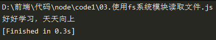

- fs.writeFile

  - 参数1： 要写入的文件路径

  - 参数2： 要写入的内容

  - 参数3： 可选的options， 默认的写入编码格式 是utf8

  - 参数4： 写入完成后的回调，只有一个 err 对象作为参数

  - 如果文件不存在则先创建再写入；如果文件存在，则直接覆盖之前的内容；

    ```javascript
    var fs = require('fs');//使用 require 导入 fs 系统模块 
     fs.writeFile('./info2.txt', '我是一个纯洁的人...123', function (err) {
      if (err) return console.log('报错了！');
      console.log('写入OK');
    }); 
    ```

    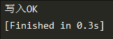

    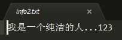

- fs.appendFile

  - 第一个参数

  - 第二个参数

    ```javascript
    var fs = require('fs');
    fs.appendFile('./info3.txt', '\n没有学不会的技术', (err) => {
      if (err) return console.log(err.message);
      console.log('追加OK')
    });
    ```

    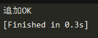

    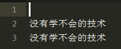

#### fs模块中路径问题

- __dirname 表示，当前这个JS文件所处的绝对目录
- __filename表示，当前这个JS文件的文件名
- 使用 __dirname 做一层拼接，防止操作文件的时候，相对路径随着执行Node命令的目录而改变。

### http模块

- 导入模块，调用方法，on方法

  - request 事件的处理函数，有两个参数

    - 第一个是 req 请求对象，包含了和请求有关的数据，比如 url 地址， 请求 的query 查询字符串， 提交的form表单， cookie
    - 第二个参数是 res 响应对象，可以将服务器处理好的数据，响应给客户端去渲染
    - res.writeHeader 第一个参数是状态码，第二个参数是响应头对象。解决中文乱码问题。
    - res.end之后不能再执行res.write

   ```javascript
    var http = require('http');//导入 http 核心模块
    var server = http.createServer();//调用 http.createServer 方法，创建服务器
    //通过 on 方法，给 刚创建的 server 服务器，绑定 request 事件处理函数
    server.on('request', (req, res) => {
      console.log('OK')
      // res.write('hello ');
      // res.write('world.');
      // res.write('hello world.');
      // 调用 res.end() 结束当前响应

      // 这种方式，表示 向客户端发送内容，并立即结束响应；
      // res.end('hello world.');

      // res.writeHeader 第一个参数是状态码，第二个参数是响应头对象；解决中文乱码问题
      res.writeHeader(200, { // text/plain 是普通文本
        'Content-Type': 'text/html; charset=utf-8'  //text/css    image/png   
      });
      res.end('<h1>瓦塔西，名侦探小五郎</h1>');
      // 注意：end之后不能再执行write
      // res.write('123');执行这句代码会报错
    })

    //通过 server.listen 方法启动服务器，同时指定 端口号、IP地址(可选)，启动完成后的回调函数
    server.listen(3000, '127.0.0.1', () => {
      console.log('server running at http://127.0.0.1:3000')
    });
   ```

    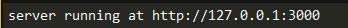

    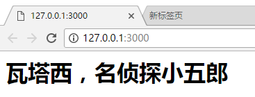


#### 请求处理响应

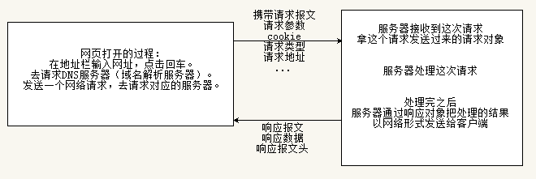

####http进阶

- 根据不同的URL地址响应不同HTML消息

  ```javascript
  var http = require('http')//导入 HTTP 模块
  var server = http.createServer()//创建服务器对象
  server.on('request', (req, res) => {//绑定 request ，每当有客户端请求这个服务器，都会触发 request 事件
    // 拿到每次请求的 url 地址
    var url = req.url;
    // console.log(url)
    // 参数1： 响应状态码
    // 参数2： 响应头对象
    res.writeHeader(200, {
      'Content-Type': 'text/html; charset=utf-8'
    })
    if (url === '/' || url === '/index.html') {// 请求首页
      res.end('<h1>首页</h1>')
    } else if (url === '/movie.html') { // 请求电影页面
      res.end('<h1>电影</h1>')
    } else if (url === '/about.html') { // 请求关于页面
      res.end('<h1>关于</h1>')
    } else { // 请求的路径不合法
      res.end('404. not found.')
    }
    res.end('ok')
  })
  //使用 listen 指定监听的地址和端口号，同时启动服务器
  server.listen(3000, () => {
    console.log('server running at http://127.0.0.1:3000')
  })
  ```


- 根据不同URL地址 - 响应不同的页面

  ```javascript
  // 使用 const 定义的不是变量，是常量
  const http = require('http')
  const fs = require('fs')
  // 创建一个 http 服务器
  const server = http.createServer()
  // 监听 http 服务器的 request 请求
  server.on('request', function (req, res) {
    // 拿到每次请求的URL地址
    const url = req.url;
    console.log(url)
    if (url === '/' || url === '/index.html') { // 请求的首页
      // 读取首页的文本内容，并把读取到的内容，使用 res.end 方法，发送给客户端
      fs.readFile(__dirname + '/views/index.html', 'utf-8', (err, dataStr) => {
        if (err) return res.end('404. Not found.')
        res.end(dataStr)
      })
    } else if (url === '/movie.html') { // 请求电影
      fs.readFile(__dirname + '/views/movie.html', 'utf-8', (err, dataStr) => {
        if (err) return res.end('404. Not found.')
        res.end(dataStr)
      })
    } else if (url === '/about.html') { // 请求的关于
      fs.readFile(__dirname + '/views/about.html', 'utf-8', (err, dataStr) => {
        if (err) return res.end('404. Not found.')
        res.end(dataStr)
      })
    } else {
      res.end('404.')
    }
  })
  // 指定端口号并启动服务器监听
  server.listen(3000, function () {
    console.log('server listen at http://127.0.0.1:3000')
  })
  ```


- 在响应不同页面的同时响应静态资源（css、图片、js）

  - index.html中引入index.css，在读文件的时候，需要把css文件也读取进来
  - 这时读取的文件用的是拼接的方式
  - 如果将html文件的读取地址设置成127.0.0.1:3000/a/b/c
  - 在html文件中引入css文件的地址是../assets/css/index.css
  - 那么会去127.0.0.1:3000/a/b/../assets/css/index.css中找文件（c表示文件，不在拼接路径中）
  - 也就是127.0.0.1:3000/a/assets/css/index.css中找文件，地址错误会找不到
  - 为了解决这个问题，可以在html文件中引入css文件的时候，使用绝对路径

  ```javascript
  const http = require('http')
  const fs = require('fs')
  // 创建一个 http 服务器
  const server = http.createServer()
  // 监听 http 服务器的 request 请求
  server.on('request', function (req, res) {
    // 拿到每次请求的URL地址
    const url = req.url;
    console.log(url)
    if (url === '/' || url === '/index.html') { // 请求的首页
      // 读取首页的文本内容，并把读取到的内容，使用 res.end 方法，发送给客户端
      fs.readFile(__dirname + '/views/index.html', (err, buf) => {
        if (err) return res.end('404. Not found.')
        // 无论什么内容，HTML， CSS， JS， 图片， 音乐， 视频.....  在进行网络传输的时候，都是以二进制形式传输的
        res.end(buf)
      })
    } else if (url === '/movie.html') { // 请求电影
      fs.readFile(__dirname + '/views/movie.html', (err, buf) => {
        if (err) return res.end('404. Not found.')
        res.end(buf)
      })
    } else if (url === '/about.html') { // 请求的关于
      fs.readFile(__dirname + '/views/about.html', (err, buf) => {
        if (err) return res.end('404. Not found.')
        res.end(dataStr)
      })
    } else if (url === '/assets/css/index.css') { // 请求样式表文件
      fs.readFile(__dirname + '/assets/css/index.css', (err, buf) => {
        if (err) return res.end('404. Not found.')
        res.end(buf)
      })
    } else if (url === '/assets/js/index.js') { // 请求的是JS文件
      fs.readFile(__dirname + '/assets/js/index.js', (err, buf) => {
        if (err) return res.end('404. Not found.')
        res.end(buf)
      })
    } else if (url === '/assets/images/1.gif') { // 请求了 1.gif
      fs.readFile(__dirname + '/assets/images/1.gif', (err, buf) => {
        if (err) return res.end('404. Not found.')
        res.end(buf)
      })
    }
    else {
      res.end('404.')
    }
  })
  // 指定端口号并启动服务器监听
  server.listen(3000, function () {
    console.log('server listen at http://127.0.0.1:3000')
  })
  ```


- 根据不同URL地址 - 响应不同文件的改造

  ```javascript
  const http = require('http')
  const fs = require('fs')
  // 创建一个 http 服务器
  const server = http.createServer()
  // 监听 http 服务器的 request 请求
  server.on('request', function (req, res) {
    // 拿到每次请求的URL地址
    const url = req.url;
    console.log(url)
    if (url === '/') { // 请求的根路径 ，需要特殊出处理
      fs.readFile(__dirname + '/views/index.html', (err, buf) => {
        if (err) return res.end('404')
        res.end(buf)
      })
    } else {
      fs.readFile(__dirname + url, (err, buf) => {
        if (err) return res.end('404')
        res.end(buf)
      })
    }
  })
  // 指定端口号并启动服务器监听
  server.listen(3000, function () {
    console.log('server listen at http://127.0.0.1:3000')
  })
  ```

- 网页中资源请求路径问题

  - 资源请求路径（html,css,js,image），对于后端来说，只一个标识符而已**，**并不一定非要对应实际的文件物理路径
  - 为了开发方便（说白了就是为了写HTML的时候有路径只能提示），我们一般都期望把资源的请求路径和实际文件的物理路径对应上

### path模块

- 拼接路径  path.join

- 获取文件名 path.basename(path[, ext])

- 获取扩展名 path.extname(path)

- 获取文件所在路径 path.dirname(path)

### art-template模块

  #### 服务器端渲染

  - 特点：Node服务器先读取模板页面，再获取要渲染的数据，然后直接在服务器端把完整的页面渲染拼接好，然后通过网络一次性的把结果发送给浏览器去显示，注意：通过服务器端渲染，在网络中传输的是一个真正页面。
  - 优点：请求次数少，速度快，对SEO友好。
  - 缺点：服务器渲染压力大，在后端可以通过缓存机制去解决。

  #### 客户端渲染

  - 特点：先访问服务器获取到模板页面，然后再通过Ajax获取要渲染的数据，拿到这两者之后，再客户端调用模板引擎，渲染得到模板字符串，然后通过JS的方式，把结果展示到页面上，真正的页面是在客户端浏览器中怼出来的，在进行网络传输的时候，第一次传输的是模板页面，第二次传输的是数据。
  - 优点：减轻了服务器端的渲染压力
  - 缺点：请求次数多，用户体验可能没有服务器端渲染好（白屏效果），对SEO不友好。

  #### 三种方式

  ```javascript
  //基于模板名渲染模板
  template(filename,data)
  //将模板源代码编译成函数
  template.compile(source,option)
  //将模板源代码编译成函数并立即执行
  template.render(source,data,option)
  ```

  ```javascript
  const http = require('http');
  const fs = require('fs');
  const template = require('art-template');
  const server = http.createServer();
  server.on('request', function (req, res) {
      var data={
          title:'this is title',
          list: [
              { id: 1, name: '尼古拉斯·赵四' },
              { id: 2, name: '托尼·屎大颗' },
              { id: 3, name: '亚历山大·贱贱' }
          ]
      }
      fs.readFile(__dirname+'/views/index.html','utf-8',(err,dataStr)=>{
          if(err) throw err;
        	/*conpile方法start*/
          const render=template.compile(dataStr)
          const htmlStr=render(data)
          res.end(htmlStr)
        	/*conpile方法end*/
        	/*render方法start*/
        	const htmlStr=template.render(dataStr,data)
          res.end(htmlStr)
        	/*render方法end*/
      })
    	/*template方法start*/
    	//不需要文件的读取，直接根据渲染模板的名字进行渲染
    	//第一个参数是渲染路径，第二个参数是数据
    	var htmlStr = template(__dirname + '/views/index.html', data)
    	res.end(htmlStr)
    	/*template方法end*/
  })
  server.listen(3000, function () {
      console.log('server listen at http://127.0.0.1:3000')
  })
  ```

  #### 实例

  - 过滤器
    - 使用art-template中的template.defaults.imports自定义一个时间过滤器
    - 过滤器方法中的第一个参数，永远是管道符前边的变量代表的值
    - 调用过滤器的时候，如果需要传参数，传递过来的参数应该从function的第二个位置开始接收
  - 获取指定目录下的所有文件
    - fs.readdir(__dirname,(err,filenames)=>{if(err) throw err;console.log(filenames)})
  - 获取状态
    - fs.stat('文件名',(err,stats)=>{console.log(stats.isFile());console.log(stats.size)})
  - 路径拼接
    - path.join('c:\\\','a','/c')
    - 接收多个路径片段为参数，参数个数不固定，最后以平台规定的连接符进行地址片段的连接
  - 异步flag
    - 异步执行的模块中加入标识flag，在模块外部设置flag是0，在模块内部flag自加，判断，当标识达到一定值的时候，再向下执行
  - 排序
    - if(n1>n2){return -1}else{return 1}
    - 排完序之后，如果前面的值要放到后面值的前面位置，则返回-1


### querystring模块

- 查询字符串
- querystring.parse(str[,sep[,eq[,options]]])
- str要解析的URL查询字符串
- sep用于界定查询字符串中键值对的子字符串，默认为&
- eq用于界定查询字符串中的键与值的子字符串，默认为=

## 箭头函数

- 箭头函数内部的this，永远和箭头函数外部的this保持一致
- 箭头函数的标准形式，() => {}
  - 变形1：如果箭头函数，左侧参数列表中，只有一个参数，可以省略 ()，x => {}
  - 变形2：如果箭头函数右侧函数体中，只有一句代码，那么，{}可以省略， () => console.log(123)
  - 变形3：根据上面两条规范，可以得到变形3，左侧只有一个参数，右侧只有一行代码x => console.log(x)
  - 注意：如果省略了函数体的 {} ，则函数体中代码执行的结果会被默认的当作返回值 return 出去，当作此箭头函数的调用返回值。

## 同步异步

- fs的readField是异步的方法

  - 执行结果：开始-写在1后面-写在2后面-写在3后面-结束-111-222-333
  - 三个文件的读取都是异步的，所以后三个结果的顺序不一定

  ```javascript
  var fs = require('fs')
  // 经过分析，发现，异步方法，无法保证执行的顺序
  console.log('开始')
  // 读取文件1
  fs.readFile(__dirname + '/files/1.txt', 'utf-8', (err, dataStr)=>{
    console.log(dataStr)
  })
  console.log('写在1后面')
  // 读取文件2
  fs.readFile(__dirname + '/files/2.txt', 'utf-8', (err, dataStr)=>{
    console.log(dataStr)
  })
  console.log('写在2后面')
  // 读取文件3
  fs.readFile(__dirname + '/files/3.txt', 'utf-8', (err, dataStr)=>{
    console.log(dataStr)
  })
  console.log('写在3后面')
  console.log('结束')
  ```

  - 嵌套执行：在读取文件1的内部读取文件2，在读取文件2的内部读取文件3。这种方法能保证执行的顺序。文件1阻塞文件2，文件2阻塞文件3。


- fs的readFieldSync是同步的方法，按照顺序执行，效率低，健壮性低。
- 健壮性
  - 代码容易维护； 
  - 容易扩展； 
  - 代码不容易出错； 
  - 哪怕出错了，也不耽误后续代码的执行； 
  - 代码出错之后，能够将错误消息记录到文件中，方便开发人员进行错误调试；
  - 甚至，只要一出错，程序立即自动给开发人员发送邮件或短信通知；

- 捕获代码中的异常

  - try-catch可以捕获同步的异常

    ```javascript
    var fs = require('fs')
    console.log('开始')
    try {
      var r1 = fs.readFileSync('./files/1.txt', 'utf-8')
      console.log(r1)
      console.log('写在1后面')
    } catch (e) {
      // 只有报错的时候，才会执行 catch 中的代码
      console.log(e.message)
    } finally {
      // 不管有没有报错，只要执行了 try, 那么，最后必然会执行 finally 中的代码
      console.log('OKOKOK')
    }
    var r2 = fs.readFileSync('./files/2.txt', 'utf-8')
    console.log(r2)
    console.log('写在2后面')
    var r3 = fs.readFileSync('./files/3.txt', 'utf-8')
    console.log(r3)
    console.log('写在3后面')
    console.log('结束')
    ```

  - try-catch不能捕获异步的异常，只能用自身的error

    ```javascript
    var fs = require('fs')
    try {
      fs.readFile('./files/1.txt', 'utf-8', (err, dataStr) => {
        console.log(dataStr)
        var aa = function () {
          throw new Error('错误了');
        }
        //在方法内部可以使用try-catch
        try {
          aa();
        } catch (e) {
          console.log(e.message)
        }
        console.log(123)
      })
    } catch (e) {
      console.log('报错了')
      // throw err;
    }
    console.log('写在后面')
    ```

## 模块化

- 什么是程序开发中的模块化：把一些功能类似的代码，封装到一个单独的文件中去，这些单独抽离出来的代码文件，就能够提供各种各样好用的功能；这种通过代码功能分割文件的方式，叫做程序中的模块化；
- 好处：保证了每个文件的功能（职能）单一；需要什么特定的功能，直接调用某一个特定的模块；对将来程序开发和维护都有好处！同时也解决了全局变量污染的问题，因为每个模块都有独立的作用域；
- Node 中的模块化，主要解决的JS文件之间的相互依赖关系


- 在require中是AMD，异步加载JS文件，是因为网络的需要


- node中是CMD，同步加载JS文件，是因为node是本地文件，不受网络的影响


- 执行模块代码之前，node.js会使用函数包装器将模块包装

  - module：表示一个模块，在Node中，最常见的模块，就是一个个的JS文件。
  - require：作用是加载其他模块用的。
  - exports：在Node的模块中，如果这个模块需要向外暴露一些成员，供其他JS模块使用，那么，需要使用exports向外暴露这些成员。

  ```javascript
  (function exports,require,module,__filename,__dirname){
      //模块的代码实际在这里
    	//样式类似于require.js的包裹代码，但本质是不同的，require是异步，node是同步
  }
  ```

### 核心模块

- 核心模块：官方，发现一些功能模块使用非常频繁，然后，官方把这些模块，编译成了二进制可执行文件，然后打包到了Node的安装包中；所以，这些核心模块就已经随着安装Node时候，被安装到了本地；
- 如何使用核心模块
  使用require（‘核心模块的名称’）；  require('fs/os/http')

### 第三方模块

- 第三方模块：还有一些使用也很频繁的代码和方法，一些团体、个人、公司，开发出了好用的模块，通过NPM官网，托管出去，供其他人下载使用的这些模块；统称为第三方模块；
- 第三方模块的使用方式：
  - 先使用npm下载这个模块，在安装第三方模块的时候，安装的名字，就是你在require时候导入的名字。
  - 使用require导入这个第三方模块。
  - 通过官方文档，试着去使用这个第三方模块。
  - 无论是核心模块、还是第三方模块，都是通过 标识符名称来引用这个模块的。

### 用户模块

- 用户模块：程序员自己定义的JS文件，都属于用户模块。
- 用户模块向外导出成员的两种方式
  - global
    - global缺点
      - 全局变量污染问题
      - 无法知道成员是从哪个模块中暴露出来的 
  - node的模块化方法

### exports 和 module.exports 

-  export和module.export指向同一个对象的时候，结果一样，一旦指向不同对象，以module.exports指向的成员为准。


- 通过 module.exports 可以使用 . 的形式追加属性，也可以使用等号直接赋值的形式导出成员。
- exports 只能通过 . 的形式追加属性；不能使用等号直接赋值的形式。
- 在一个 module 中，最终向外暴露的成员，以 module.exports 指向的对象为准。
- 在一个模块中，尽量不要混合使用 module.exports和 exports

### 模块加载规则

- 优先从缓存中加载。


- 使用 delete require.cache[__filename]来防止模块被缓存，但是一般不建议这么用，因为模块的缓存能够提高运行效率。


- 加载核心模块：优先从缓存中加载，如果缓存中没有的话，再去执行加载核心模块。
- 自己的模块：优先从缓存中加载，如果缓存中没有的话，再去执行加载用户模块。


- 用户模块的查找规则：
  - 如果不写后缀名，则先严格按照给定的文件名去查找模块并加载执行。
    index   ->  index.js  ->   index.json    ->  index.node


- 第三方模块查找规则：
  - node首先，查看项目根目录中有没有node_modules 文件夹
  - 查找node_modules 文件夹中，有没有和第三方模块名称一致的文件夹
  - 在模块对应的文件夹中，查找有没有package.json 这个文件
  - 在package.json 文件中，查找有没有 main 属性
  - 如果有 main 属性，并且 main 属性指向的路径存在，那么就尝试加载这个路径指定的文件
  - 如果 package.json文件中，没有 main 属性，或者 main属性指向的路径不存在，或者没有package.json文件， 那么，Node尝试加载 模块根目录中 index 相关文件：index.js -> index.json -> index.node
  - 如果在node_modules文件夹中，找不到对应的模块文件夹，或者在项目根目录中根本没有node_modules文件夹，则向上一层文件夹中去查找，查找规则同上
  - 如果上一层目录中也没有查找到，则再向上翻一层去查找，直到找到当前项目所在的盘符根目录为止
  - 如果找到了盘符根目录还找不到，则报错：cannot find module ***


## 回调函数

- 异步函数的执行结果，不能确定先后顺序，不能使用return

- 调用者知道要执行什么操作，不知道异步方法什么时候执行完

- 异步方法知道什么时候执行完，但是不知道执行什么操作

- 在一个方法的封装中，无论方法执行成功了还是失败了，都属于方法执行的结果

- 回调函数中最好把失败结果也交给调用者，让调用者去决定处理之后的过程

- callback的第一个参数永远是Error对象，成功的结果从参数列表的第二个位置传递出去

  ```javascript
  const fs=require('fs')
  function getFileSize(filePath,callback){
      if(err) return callback(err)
    	const size=stats.size
      callback(null,size)
  }
  var result=getFileSize(__dirname+'/package.json',function(err,result){
      if(err) return console.log('执行出错了')
    	console.log(result)
  })
  ```


## 封装的两个原则

- 方法的执行结果不应该在方法内部私自处理，应该返回给调用者，让调用者决定


- 保证封装的模块或者方法职能单一


## 前端后端的比较
- 首先要了解HTTP协议的请求-处理-响应模型
  - 请求：浏览器中显示的任何HTML页面、JS、CSS、图片、API接口，都需要通过网络，去请求后端服务器。
  - 处理：前端的资源请求，必然通过网络去请求后台服务器，服务器在接收到请求之后，必然有一个处理的过程，（比如读取文件、调用数据库、后端渲染模板页面等），如果前端请求的URL地址，后端没有做对应的处理，则前端肯定拿不到想要的资源。
  - 响应：当后端把前端请求的资源处理好之后，会通过网络把资源发送给前端去解析、显示。
- 后端服务器是Web服务的核心，如果没有服务器，前端根本获取不到任何内容。
- 如果前端请求的资源路径，后台服务器没有做对应的处理，则前端是获取不到该资源的。

## Node阶段思想转变

- 浏览器中看到的任何页面和静态资源，都是Node服务器代码处理并返回的结果

- 只要是资源，必然会涉及到请求-处理-响应三个过程
- 浏览器中一个页面的请求过程：浏览器请求页面 -> Node服务器处理该请求并返回 -> 浏览器加载解析页面HTML结构和JS代码 -> 解析过程中发起静态资源的二次请求 -> 服务器处理这些二次资源请求　－> 页面加载解析完毕后正常显示

## MVC和MVVM

- 针对英雄列表案例

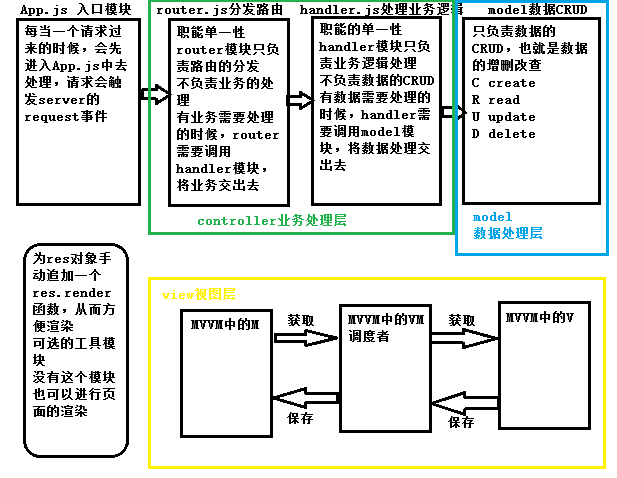

- MVC是后台分层架构思想，实现职能单一性、可维护性、可扩展性


- MVVM是前端（视图层）的分层思想


- MVC是站在整个项目的角度去宏观对项目进行分层，包含了后端和前端


- MVVM只是前端的思想，并没有站在整个项目的角度，只是把MVC中View这一层单独抽离出来，针对view层进行三层划分M（model） V（view） VM（调度者） 
- MVC中V和M数据的交互通过VM，VM分割了M和V 。每当view层要渲染数据，需要从VM中获取，如果要保存数据，需要调用VM保存到model中


- MVVM好处，实现数据的双向绑定


- 双向数据绑定，避免了程序员手动操作DOM，数据驱动视图


## 例子知识点

### 302重定向

```javascript
//改变跳转的路径
res.writeHeader(302, { 'Location': '/' });
res.end();
```

### 阻止默认表单行为

e.preventDefault();

### req和res

res是引用类型，所以只要在res上挂载方法，无论怎样都可以访问到res上的方法

chunk

表示客户端提交的数据，一块一块的 


