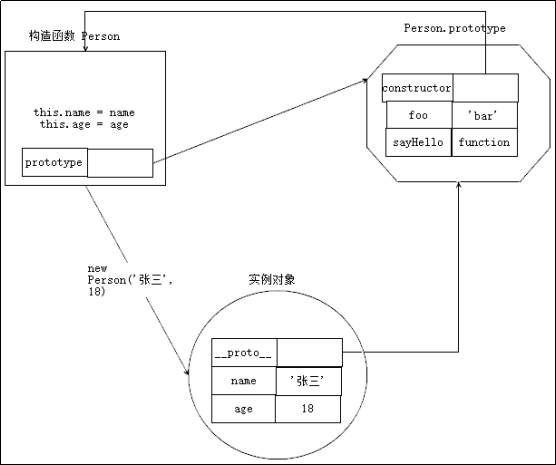
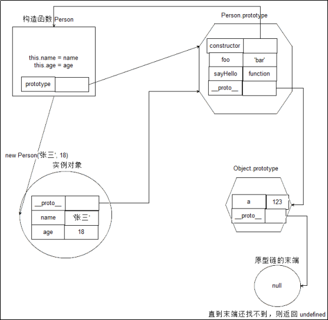

# 对象

## 对象
### 概念

+ JS中的对象：无序属性的集合，可以包含基本值、对象或函数
+ 数组是一种特殊的对象，有序，数组的键名是有序的下标
+ 一个自由的变量（通过var声明），如果有一个变量归属于一个对象下面，该变量是对象的一个属性
+ 一个自由的函数，如果一个函数归属于一个变量下面，该函数是对象的一个方法,只有对象才可以挂载属性和方法
+ 万物皆对象，对象是一个容器，封装了属性和方法，是数据集和功能集，是无序属性的集合，包含基本值、对象或函数。封装性，继承性，多态性。

### 访问属性的两种方式

+ .语法，可以跟常规属性，不可以跟变量，简便
  * document.getElementById("box").style.borderColor="red"
+ []语法，可以放变量，也可以放常规属性，常规属性必须加引号扩起来，适用范围广
  * document.getElementById("box").style["borderColor"]="red"

## 面向对象
### 介绍

+ 面向对象是过程式代码的封装，目的在于提高代码的开发效率和可维护性
+ 面向对象封装原则：自己管理自己

### 创建对象

#### 简单方式

```html
<script>
  var person=new Object()
  person.name='jack'
  person.age=18
  person.sayName=function () {
    console.log(this.name);
  }
</script>
```
每次创建new Object比较麻烦，所以可以通过字面量的方式来创建
```html
<script>
  var perspn= {
  name:'jack',
  age:18,
  sayName:function () {
    console.log(this.name);
  }
}
</script>
```
但是如果要创建多个对象，就要创建多个字面量，代码冗余，重复性高

#### 工厂函数

* 工厂函数可以解决代码复用的问题，解决了创建多个相似对象代码冗余的问题。但是不能判别对象的类型。
```html
<script>
  function createPerson(name, age) {
    var instance = {
      constructor: createPerson,
      name: name,
      age: age,
      sayHello: function () {
        console.log('hello ' + this.name)
      }
    }
    return instance
  }
  var xiaoming = createPerson('小明', 16)
  var xiaohong = createPerson('小红', 15)
</script>
```
* createCar中返回值是createPerson，但是具体实例调用createPerson的时候，却不能跟createCar中的内容匹配
```html
<script>
  function createCar() {
    return {
      constructor: createPerson
    }
  }
  xiaoming.sayHello()//hello 小明
  console.log(xiaoming.constructor === createCar)//false
</script>
```
#### 构造函数

##### 更优雅的工厂函数

* 可以判断类型，判断实例和构造函数之间的关系
* 创建两个函数，Person和Car。
* 与createPerson的区别：没有显示的创建对象，直接将属性和方法赋给了this对象，没有return语句，函数名大写
* 如果用普通的Person函数名调用，那么函数中的this指的是window。
* 如果用new操作符调用Person，就是构造函数调用，函数中先创建一个对象var instance={ }，instance指的是实例，然后将内部的this指向instance，this=instance，操作this就是操作instance，最后默认返回this或者instance
* constructor和instance都可以用来判断实例和构造函数之间的关系
* 对象的constructor用来标识对象类型，但是检测对象类型，instance更可靠
```html
<script>
  function Person(name, age) {
    this.name = name
    this.age = age
    this.sayHello = function () {
      console.log('hello ' + this.name)
    }
  }
  function Car() {}
  var p1 = new Person('小明', 18)
  var p2 = new Person('小刚', 15)
  p1.sayHello()//hello 小明
  p2.sayHello()//hello 小刚
  console.log(p1.constructor === Car)//false
  console.log(p2.constructor === Person)//true
  console.log(p1 instanceof Person)//true
</script>
```
* 但是构造函数也有缺点，每new一个构造函数，就会创建一个sayHello函数

##### 构造函数改进

* 把构造函数中的函数提取出来公用，包到一个函数里面
```html
<script>
  var methods = {
    sayHello: function () {
      console.log('hello ' + this.name)
    },
    f1: function (argument) {
      console.log('f1')
    },
    f2: function (argument) {},
    f3: function (argument) {}
  }
</script>
```
* 定义构造函数，里面放一个循环，遍历公用的methods，复制到构造函数中
* 谁调用，this就指向谁
```html
<script>
  function Person(name, age) {
  this.name = name
  this.age = age
  for(var key in methods) {
    this[key] = methods[key]
  }
}
var p1 = new Person('张三')
var p2 = new Person('李四')
p1.sayHello()//hello
p2.sayHello()//hello
console.log(p1.sayHello === p2.sayHello)//true
</script>
```
### 原型对象

+ 每个函数都有一个自带的属性prototype，prototype是一个对象，相当于上面手动创建的methods，这里的prototype不在全局，存在于Person函数对象的内部，可以把共享的方法定义到prototype中，实例可以访问到

#### 构造函数，原型对象，实例三者关系

  * 创建一个构造函数，任何函数都具有prototype属性，该属性是一个对象，所以构造函数中也有prototype。

  * 构造函数的prototype对象默认有一个constructor属性，指向prototype对象所在的函数。

  * 通过构造函数得到的实例对象内部会包含一个指向构造函数的prototype对象的指针\_proto\_所有实例都直接或间接地继承了原型对象的成员

  * 访问原则：访问实例上的某个成员的时候，会先在自己身上找，如果自己身上没有就去原型对象上面查找

    
#### 实例对象读写原型对象成员

* 对于原型对象中的普通类型成员，实例对象是无法修改的，实例对象只能访问。
* 无论是普通数据成员还是引用类型成员，实例都无法通过重新赋值的方法修改，但是引用类型可以先访问再修改

#### 原型对象的语法

* 每添加一个属性就要写一次prototype，比较麻烦,可以用下面这种写法
```html
<script>
  Person.prototype={
    f1:function() {
      console.log('f1')
    },
    f2:function() {
      console.log('f2')
    }
  }
</script>
```
* 但是这样相当于指向了一个新的对象，constructor就丢失了，这里为了程序的严谨性，需要手动把constructor加上
```html
<script>
  Person.prototype={
    constructor:Person,
    f1:function() {
      console.log('f1')
    },
    f2:function() {
      console.log('f2')
    }
  }
</script>
```
* 由于constructor有被丢失的风险，所以推荐使用instanceof操作符，这种操作符是JavaScript内置的一个操作符，专门用来判断实例和构造函数之间的关系
```html
<script>
  Person.prototype={
    f1:function() {
      console.log('f1')
    },
    f2:function() {
      console.log('f2')
    }
  }
  console.log(new Person() instanceof Person)
</script>
```
#### 原型链

+ 所有的构造函数都有prototype
+ 实例函数的 constructor 是 Function，Function 的 constructor是 Function 自身
+ F.prototype是一个对象，F.prototype由大Object创建出来的，原型对象也有自己的原型对象
+ 对象属性的访问机制就是原型链：
  * 当访问对象的某个成员的时候，先在自己身上找，找到即返回使用，

  * 找不到，沿着原型链向上查找，如果在上一个原型对象中找到，则返回使用，

  * 如果找不到，则继续沿着原型链查找，直到Object.prototype，此时已经是末端，

  * 如果还找不到，Object.prototype.\_proto\_=null，这时候返回undefined

    

## 对象方法
### 数组对象方法

#### forEach

* 用来遍历数组，每循环一次就调用一次传递的函数
```html
<script>
  Array.prototype.myEach=function(fn) {
    for(var i=0;i<this.length;i++) {
      fn(this[i],i)
    }
  }
  var arr=[10,1,5,8,50];
  arr.myEach(function(item,index) {
    console.log(item,index)
  })
</script>
```
#### some

* 根据条件判断数组中是否有符合该条件的元素
* 如果有，找到第一个符合条件的元素，返回true，终止遍历
* 如果没有，返回false
```html
<script>
  Array.prototype.mySome=function(fn) {
    var isHave=false;
    for(var i=0;i<this.length;i++) {
      if (fn(this[i],i)) {
        isHave=true;
        break;
      }
    }
    return isHave;
  }
  var arr=[
    {age:19},
    {age:20},
    {age:18}
  ];
  var ret=arr.mySome(function(item) {
    return item.age<18;
  })
  console.log(ret)//false    
</script>
```
#### ever

* 如果找到第一个符合条件的元素，直接返回true，同时终止遍历
* 如果遍历找不到符合条件的元素，返回false
```html
<script>
  Array.prototype.myEvery=function(fn) {
    var isEvery=false;
    for(var i=0;i<this.length;i++) {
      if (!fn(this[i],i)) {
        isEvery=false;
        break;
      }
    }
    return isEvery;
  }
  var arr=[
    {age:19},
    {age:20},
    {age:18}
  ];
  var ret=arr.myEvery(function(item) {
    return item.age>17;
  })
  console.log(ret)//true   
</script>
```
#### filter

* 遍历整个数组，符合条件的元素过滤到一个新数组
```html
<script>
  Array.prototype.myFilter=function(fn) {
    var tmp=[];
    for(var i=0;i<this.length;i++) {
      if (fn(this[i],i)) {
        tmp.push(this[i])
      }
    }
    return tmp;
  }
  var arr=[
    {age:19},
    {age:20},
    {age:18}
  ];
  var newArr=arr.myFilter(function(item) {
    return item.age>18;
  })
  console.log(newArr) 
</script>
```
#### find

* 找到符合条件的第一个元素并返回（和some不同的是，some返回的是布尔值）
* 这里的return和break不能同时用，因为用了return之后立刻停止遍历，那样就访问不到break，break在前的时候，同理
* 所以这里把得到的值先赋给循环外面的instance，最后返回instance
```html
<script>
  Array.prototype.myFind=function(fn) {
    var instance=undefined;
    for(var i=0;i<this.length;i++) {
      if (fn(this[i],i)) {
        instance=this[i]
      }
    }
    return tmp;
  }
  var arr=[
    {age:19},
    {age:20},
    {age:18}
  ];
  var newArr=arr.myFind(function(item) {
    return item.age>18;
  })
  console.log(newArr) 
</script>
```
#### findIndex

* 找到第一个符合条件的元素的索引
```html
<script>
  Array.prototype.myFindindex=function(fn) {
    var instance=undefined;
    for(var i=0;i<this.length;i++) {
      if (fn(this[i],i)) {
        index=i;
        break;
      }
    }
    return index;
  }
  var arr=[
    {age:19},
    {age:20},
    {age:18}
  ];
  var ret=arr.myFindindex(function(item) {
    return item.age>18;
  })
  console.log(ret) 
</script>
```
#### include

* 判断数组中是否包含某个元素，和some一样

#### map

* 将每个元素处理之后返回一个新的数组
```html
<script>
  Array.prototype.myMap=function(fn) {
    var tmp=[];
    for(var i=0;i<this.length;i++) {
      tmp.push(fn(this[i],i))
    }
    return tmp;
  }
  var arr=[1,2,3];
  var ret=arr.myMap(function(item) {
    return item+1;
  })
  console.log(ret) 
</script>
```
* 这里的原数组是值类型，复制的时候不会改变原有的值
* 如果原来的数组是引用类型，map方法作用之后会改变原来的内容

#### reduce

* 累加器和数组中的每个元素（从左到右）应用一个函数，将其减少为单个值
* 第一次遍历，prev是索引为0的数值，curr是索引为1的数值
* 之后的遍历，prev是前面里两个数的和，curr依旧按照索引向后排 
* 数组的长度为0，报错：Reduce array with no initial value
* 数组的长度为1，直接把0返回
* 数组的长度为2，直接调用一次fn
* 数组的长度大于2，先调用fn然后才从下标2开始遍历，遍历的过程调用fn
* 能参与运算的只有数值，如果return prev.age+curr.age只能计算第一次
* 因为第一次得出的结果会传入prev，此时的prev是数值类型，不能点age
* 所以reduce函数需要传入一个参数，这个参数使得数组从索引0开始遍历，初始值是这个参数
```html
<script>
  var users = [
  {age: 18},
  {age: 16},
  {age: 3}
  ]
  Array.prototype.myReduce = function (fn, initialValue) {
    if (this.length === 0) {
      return console.log('数组不能为空')
    } else if (this.length === 1) {
        return this[0]
    } else if (this.length === 2) {
        return fn(this[0], this[1])
    } else if (this.length > 2) {
        if (initialValue === undefined) {
          var ret = fn(this[0], this[1])
          for (var i = 2; i < this.length; i++) {
            ret = fn(ret, this[i])
          }
          return ret
        } else {
          var ret = initialValue
          for (var i = 0; i < this.length; i++) {
            ret = fn(ret, this[i])
          }
          return ret
        }
    }
  }
  var ret = users.myReduce(function (prev, curr) {
    console.log(prev, curr)
    return prev + curr.age
  }, 0)
  console.log(ret)
</script>
```
* 其中initialValue表示的就是传入的这个参数
* 数组长度为0的时候报错
* 数组长度是1的时候直接返回这个元素
* 数组长度是2的时候返回数组前两个元素
* 数组长度大于2的时候，进行判断
* 如果没有传入这个参数，数组是从索引2开始遍历，每次得到的结果再传回fn
* 如果传入了这个参数，数组从索引0开始遍历，每次得到的结果传回fn