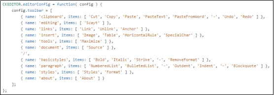
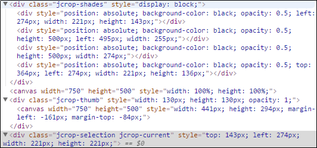

# 插件 

## seaJS
- 介绍
  + 自执行函数中，用 window 导出的成员变成全局函数，容易被污染,用 seajs 解决
  + seajs 是一个使用预浏览器环境的 JavaScript 模块加载器。一个库文件，类似于 jquery
  + seaJS 遵循 CMD 规范，可以像 node 一样书写代码
  + 依赖的自动加载、配置简洁清晰，兼容性非常好，几乎可以运行在任何浏览器引擎上
  + seaJS 不提供任何功能性的 API，只提供了解决 JavaScript 代码的明明污染和文件依赖的问题
  + 在页面中引入 sea.js，使用 define 函数定义模块，使用 require 函数加载模块，使用 module.exports 对外暴露接口对象，使用 seajs.use 函数启动模块系统
- 使用
  + seajs.use
    * 加载模块，启动模块系统， 在调用 seajs 之前需要先引入 sea.js 文件
    ```html
    <script src="js/sea.js"></script>
    <script>
      seajs.use('./js/main.js')
    </script>
    ```
  + define
    * define 是一个全局函数，用来定义模块
    * define 接收 factory 参数，factory 可以是一个函数，也可以是一个对象或字符串
    * factory 是对象、字符串时，表示模块的接口就是该对象、字符串
    * factory 是一个对象，define({})
    * factory 是一个字符串，define(‘hello’)
    * factory 是一个函数，define(function(require, exports, module) {})
    ```html
    <script>
      define(function (require, exports, module) {
        var foo = 'baz';
        console.log('a.js文件被执行了');
        var add=function(x,y) {
          return x+y;
        }
      })
    </script>
    ```
  + require
    * require 用来加载一个 js 文件模块，用来获取指定模块的接口对象 module.exports，在加载和执行的时候，js 会按照同步的方式和执行
    * 模块 factory 的构造方法的第一个参数必须命名为 require，不要重命名 require 函数，或在任何作用域中给 require 重新赋值，require 的参数值必须是字符串直接量
    * 谁 require 谁就得到内部的 module.require 接口对象
    ```html
    <script>
      define(function (require, exports, module) {
        var foo = 'bar'
        console.log('main.js 文件代码被加载执行了')
        var aExports = require('./a.js')
        var bExports = require('./b.js')
        console.log(foo)
        console.log(aExports)
        var ret = aExports.add(aExports.x, aExports.y)
        console.log(ret)
        console.log(aExports.foo)
        console.log('bExports foo = ' + bExports.foo)
      })
    </script>
    ```
  + module
    * module是一个对象，上面存储了与当前模块相关联的一些属性和方法
    * module.id模块的唯一标识，可以通过define方法的第一个参数来指定，默认为该模块文件的绝对路径
    * module.url模块的绝对路径
    * module.dependencies数组，表示当前模块的依赖
    * module.exports当前模块对外提供的接口对象，相当于每个模块内部最终都执行了return module.exports，模块与模块之间的通信接口
    * 把希望被外部访问的成员挂载到module.exports上就可以了
    ```html
    <script>
      define(function (require, exports, module) {
        var foo = 'baz'
        console.log('a.js 文件代码被加载执行了')
        var add = function (x, y) {
          return x + y
        }
        console.log(module.exports)
        module.exports.x = 10
        module.exports.y = 20
        console.log(module.exports)
        module.exports.add = add
        module.exports.foo = foo
      })
    </script>
    ```
  + exports
    * exports是module.exports的一个引用。
    * 修改exports就相当于修改module.exports。
    * 但是一旦在factory内部给exports重新赋值，并不会改变module.exports的值，因此给exports赋值无效
    * 也就是用exports去点一个成员，是成功引用，但是让exports等于什么是无效的
    * 下面的写法等价于上面的，因为exports指向的是module.exports
    ```html
    <script>
      module.exports.a = 1
      module.exports.b = 2
      module.exports.c = 3

      exports.a = 1
      exports.b = 2
      exports.c = 3
    </script>
    ```
  + 模块标识
    * 模块标识是一个字符串，用来标识模块，可以不包含文件后缀名，比如 .js
    * 相对标识以 . 开头，永远相对于当前模块所处的路径来解析
    * 顶级标识不以 . 或 / 开始，会相对模块系统的基础路径，如果不设置，base路径默认就是sea.js库文件所属的路径，可以通过seajs.config({base:’基础路径’})
  + exprots和module.exports的区别
    * 只需要导出函数字符串，数组的时候，导出单一成员，始终 return 的是 module.export
    * 不管 export 之后被重新赋值成什么，都不会造成影响，所以需要给 module.export 才管用
    * 为了开发体验，API 更友好，使用 exports 的时候，可以少些一点
    * 下面的例子，这里重新赋值之后，不能再访问到b，所以只能输出a
    ```html
    <script>
      exports.a=123
      exports='hello'
      exports.b=456
    </script>
    ```

## requireJS

- 简介
  - 引入require库，是代码模块化，模块和模块之间既可以相互依赖，又不相互影响

  大部分浏览器都支持


- 使用
  - require.js在内部，动态生成一个script标签

  - 可以通过两种方式加载require

  - 第一种

    - data-main是自定义属性，指定入口文件（起始文件，主文件）
    - 先加载require.js后加载main.js，实际是在内部动态生成一个script标签，引入了main.js
    - 这种做法类似jsonp，这种请求是异步的（不阻塞的）

    ```html
    <script data-main="main.js" src="require.js"></script>
    ```

  - 第二种

    - 在标签中另外引入起始文件，文件名的后缀可以省略。这种请求也是异步的。

    - function是require的第二个参数，写回调函数。

    ```html
    <script type="text/javascript">
    	require(['main'],function() {
            console.log(123);
        })
      	console.log(456);
    </script>
    ```

  - main.js文件中的返回值给了require.js中回调函数的参数，可以是数值，字符串，数组，对象

  - 如果想要返回多个参数，可以用对象包裹。

  - 下面是标准模块的样式

  ```html
  <script>
      //拥有私有空间
    	define(function(){
      	var abc=123;
      	return abc;//导出成员
    })
  </script>
  <script>
    	require(['main'],function(m){
          console.log(m);
      })
  </script>
  ```

  - 模块所需要依赖的文件，写在define的第一个参数的位置
  - 如果依赖多个文件，需要用逗号隔开，依赖文件中如果有return，在function中需要参数来接收，如果没有return，不需要接收，并且这个依赖文件要放到最后，防止影响其他参数的接收

  ```html
  <script>
      //拥有私有空间
    	define(['./mo1.js','./mo2.js','./mo3.js'],function(){
      	//使用require之后，模块之间可以相互依赖，这种形式被称作依赖树
    })
  </script>
  ```

  - 常用参数有三个

    - baseUrl表示查找模块的参考路径
    - paths给模块起名，方便依赖模块时使用，不需要过多考虑模块之间的相对路径
    - shim把非标准模块变成标准模块

    ```html
    <script>
      	require.comfig({
            baseUrl:'./js',//设置查找模块的参考路径
          	paths:{
                m1:'../module1',
              	m2:'../module2',
              	m3:'../module3'
            },//给模块起名字，方便依赖模块的使用，起名字之后，直接用名字就可以，不需要考虑相对路径或者绝对路径
          	shim:{
                t:{
                    exports:'foo'
                }
            }//把非标准模块变成普通模块
        })
    </script>
    ```


## jquery.cookie

- 简介

  - cookie属于jQuery的插件
  - 可以读取删除写入cookie

- 使用

  ```html
  <script>
    	$.cookie('the_cookie','the_value')
    	//这里没有指定cookie的有效时间，所创建的cookie的有效期默认到用户关闭浏览器为止，所以被称为会话cookie
  </script>
  <script>
    	$.cookie('the_cookie','the_value',{expires:7});
    	//这里指明了cookie的有效时间为7天，被称为持久cookie，如果有效时间设置在当前或者之前的时间，那么cookie会被立即删除
  </script>
  <script>
    	$.cookie('the_cookie','the_value',{expires:7,path:'/'});
    	//默认情况只有cookie页面才能读取cookie，如果想让一个页面读取其他页面的cookie，必须设施路径。path用来设置能够读取cookie的页面的顶级目录，设置成网站根目录，可以让所有网页都读取cookie，这样可能会产生冲突
  </script>
  <script>
  	$.cookie('the_cookie');
    	//读取cookie
  </script>
  <script>
  	$.cookie('the_cookie',null);
    	//删除cookie，通过传递null作为cookie的值
  </script>
  <script>
  	$.cookie('the_cookie','the_value',{
          expires:7,
        	path:'/',
        	domain:'jquery.com',
        	secure:true
      })
    	//domain表示创建该cookie的页面域名,secure如果值为true，那么cookie的传输会要求一个安全协议，HTTPS
  </script>
  ```

## jquery.validate

- 简介

  - 用来验证表单，基于jQuery，通信方式是get
  - 需要打开Apache，访问本地demo

- 使用

  ```html
  <input type="password" name="password" id="password" data-required data-pattern='^[0-9]+$' data-conditional='confirm' data-description='age' data-describedby='age-description'>
  <div id="age-description"></div>
  <button type="submit" class="btn btn-priamry"></button>
  <script>
  	$('form').validate({
          onKeyup:true,
        	eachValidField:function(){
              $(this).closest('div').removeClass('error').addClass('success')
          },
        	eachInvalidField:function(){
              $(this).closest('div').removeClass('success').addClass('error')
          }
      })
  </script>
  <script>
  	conditional:{
          confirm:function(){
              return $(this).val()==$('#password').val();
          }
      }
  </script>
  <script>
  	description:{
          age:{
              required:'<div class="alert alert-error">年龄不能为空</div>'
            	pattern:'<div class="alert alert-error">格式错误</div>'
            	conditional:'<div class="alert alert-error">conditional</div>'
            	valid:'<div class="alert alert-error">valid</div>'
          }
      }
  </script>
  ```

  - data-required必须输入，表示参与验证
  - data-pattern模式匹配
  - data-conditional自定义验证条件
  - data-description指定提示信息的内容，data-describedby指定提示信息的位置。这两个属性经常连用
  - div放在哪里，信息提示就出现在哪里
  - basic用法中，键盘抬起时进行判断，如果每项验证都通过，找最近的父元素div，移除error类，添加success类，反之操作相反
  - conditional中，除了简单的判断，还添加自定义的验证条件
  - description中，除了简单判断，还可以进行提示信息的内容的设置

## jquery.form

- 简介

  - form用来提交表单，基于jQuery，最重要的是ajaxSubmit方法

- 使用

  - 引进插件form之后，调用ajaxSubmit方法，提交表单

  - target指定从后台响应过来的内容显示在id值为tar的模块里

  - data附加一个域，提交额外的，不需要显示在表单中的数据，这样就不必要建一个类型为hidden的input了

    ```html
    <script>
    	$('#btn').click(function){
            $('form').ajaxSubmit({
                type:'post',
              	url:'./data.php',
              	target:'#tar',
              	data:{flag:123,abc:'hello'},
              	success:function(data){
                    console.log(data);
                }
            })
        }
    </script>
    ```

- validate结合form

  ```html
  <script>
  	$('form').validate({
          sendForm:false,//阻止submit按钮的默认提交行为
        	valid:function(){
            	//所有的验证都通过会触发这个方法
              $(this).ajaxSubmit({
                  
              })
            	//传统的同步提交方式
            	//$(this).get(0).submit();
          }
      })
  </script>
  ```

  ```html
  <form>
    	用户名：<input data-required type='text' name='uname'><br>
    	密码：<input data-required data-pattern='^\d+$' type='password' name='pw'><br>
    	<input type='submit' value='提交' id='btn'>
  </form>
  ```

  - sendForm的值为false表示阻止summit的默认提交行为
  - valid表示所有标签验证通过之后，执行后面的函数
  - 对html文件中的input标签添加验证的属性
  - form的action表示提交到的地址，如果不写action，当前页面刷新
  - 传统的提交方式是同步的提交方式，get(0)得到的是原生dom，有submit方法
  - 用插件实现的是异步提交

## jquery.uplodify

- 简介

  - uploadify用来长传文件，基于jQuery

- 使用

  ```html
  <input type='file' id='myfile'>
  <div id='imgId'></div>
  <script type='text/javascript'>
  	$('#myfile').uploadify({
          fileObjectName:'myfile',
        	itemTemplate:'<span></span>',
        	buttonText:'选择文件',
        	buttonCalss:'imgstyle',
        	swf:'./uploadify.swf',
        	uploader:'file.php',
        	onUploadSuccess:function(a,b,c){
              $('#imgId').html(b);
          }
      });
  </script>
  ```

  - 如果需要上传图片，创建一个div用来放图片
  - 创建file的input按钮，id值设置成myfile
  - fileObjName根据哪个名称去接收，相当于input中的name
  - itemTemplate不显示进度条，但是不能用空字符串表示，要用空标签
  - buttonText表示提交按钮的value值
  - buttonClass为提交按钮添加类名，控制样式
  - swf是一个flash文件
  - uploader后台的处理接口
  - onUploadSuccess表示加载成功之后执行的function
  - 如果不设置itemTemplate进度条在图片未完全上传的时候会在图片上方显示，图片加载完全之后，进度条自动消失

## datepicker

- 简介

  - 用来选择时间的插件，基于bootstrap，获取焦点之后，弹出时间表格

- 使用

  ```html
  <input data-provide='datepicker' data-date-language='zh-CN' data-date-format='yyyy-mm-dd' name='tc_join_date' value='{{tc_join_date}}' type='text' class='form-control input-sm'>
  ```

  - data-date-language='zh-CN'表示日期表格中用中文
  - data-date-format='yyyy-mm-dd'表示日期格式

## ckeditor

- 简介

  - ckeditor富文本标记工具

- 使用

  - 功能根据自己的需求进行选择，下面的内容，需要的留下，不需要的删除就可以

    

  - 需要富文本的地方，不论是textarea或者是div，id值修改成editor就可以

  - 富文本的内容发生改变的时候，只在自身模块发生改变，在frame标签内部，所以只刷新自身的页面，如果需要更新内容，需要更新富文本内容

    ```html
    <script>
    	for(var instance in CKEDITOR.instances){
            CKEDITOR.instance[instance].updateElement();
        }
    </script>
    ```

## jcrop

- 简介

  - jcrop是裁切图插件，可以将图片裁切，显示缩略图，结合上传功能可以实现裁切图片的保存，裁切区域可以是矩形可以是圆形，大小可调，位置可调，比例可确定

- 使用

  - 分成两部分，第一部分是遮挡层，第二部分是裁切部分

  - 遮挡层分成四部分，分布在裁切区域的四周

    

    ```html
    <script>
    	$('#target').Jcrop({
            aspectRatio:1,
          	setSelect:[175,100,400,300]
        },function(){
            var jcrop_api=this;
          	thumbnail=this.initComponent('Thumbnailer',{width:130,height:130})
        })
    </script>
    ```

  - aspectRatio表示缩放的比例，值为宽比高

  - bgColor表示背景色

  - bgOpacity表示背景的透明度

  - setSelect确定裁切图初始状态的大小和位置

  - thumbnail可以设定缩略图的固定宽高，后面可以加自己定义的属性

  - 缩略图的位置可以通过添加自定义属性的方式确定


